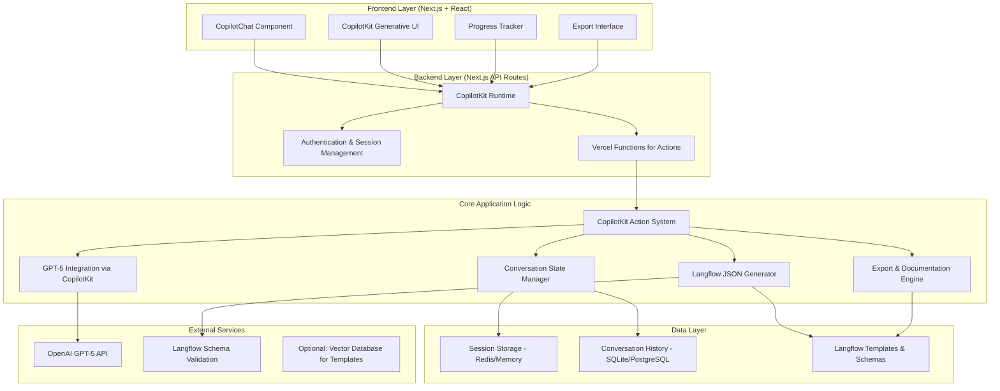

# Socratic Langflow Architect - Standalone Application Architecture

## 1. Introduction

This document outlines the technical architecture for the "Socratic Langflow Architect" standalone application. Based on the requirements in the Standalone Application PRD, this architecture represents a complete redesign as an independent web application with modern chatbot UI and GPT-5 integration.

The system is designed to be scalable, user-friendly, and capable of supporting sophisticated Socratic dialogue, real-time workflow generation, and comprehensive artifact export.

## 2. High-Level Architecture

The application follows a modern React-based architecture with CopilotKit providing pre-built AI chat components and conversation management. The unified Next.js platform handles both frontend and backend concerns through a single deployment.



## 3. Technology Stack

### 3.1 Frontend Framework (UPDATED)

**Selected: Next.js + React + CopilotKit (Optimal Choice)**
- **Advantages**: Professional chat UI, streaming support, action system, generative UI
- **CopilotKit Benefits**: 
  - Pre-built components (`CopilotChat`, `CopilotSidebar`, `CopilotPopup`)
  - Built-in streaming and real-time updates
  - Action system for workflow generation (`useCopilotAction`)
  - Headless options for complete customization
  - Agent integration for complex workflows
- **Implementation**: TypeScript, Tailwind CSS, CopilotKit components
- **Deployment**: Vercel (seamless Next.js deployment)

### 3.2 Backend Stack (UPDATED)

**Core Framework**: Next.js API Routes + CopilotKit Runtime
- **Advantages**: Unified deployment, built-in API endpoints, CopilotKit integration
- **Features**: Server actions, API routes, edge runtime support
- **CopilotKit Runtime**: Built-in backend handling for AI conversations

**LLM Integration**: CopilotKit + OpenAI GPT-5
- **CopilotKit Benefits**: Built-in OpenAI integration, streaming, context management
- **Action System**: `useCopilotAction` for structured workflow generation
- **Agent Support**: CoAgent integration for complex multi-step workflows

### 3.3 Data Storage

**Session Management**: Redis or In-Memory
- **Purpose**: Active conversation state, real-time data
- **TTL**: Configurable session timeouts
- **Scalability**: Easy horizontal scaling

**Conversation History**: SQLite (development) / PostgreSQL (production)
- **Schema**: User sessions, conversation turns, generated artifacts
- **Persistence**: Long-term storage for analytics and user history
- **Backup**: Regular exports and cloud backup

**Templates & Schemas**: File-based Storage
- **Langflow Templates**: JSON files with common workflow patterns
- **Schema Definitions**: Current Langflow JSON schema for validation
- **Component Library**: Database of available Langflow components

## 4. Core Components (CopilotKit Architecture)

### 4.1 CopilotKit Chat Interface

**Purpose**: Professional chat UI with built-in AI conversation handling

**Key Features**:
- **Pre-built Components**: `CopilotChat`, `CopilotSidebar`, `CopilotPopup`
- **Streaming Support**: Real-time response streaming out of the box
- **Customizable UI**: Full control over styling and component behavior
- **Action Integration**: Seamless integration with workflow generation actions

**Implementation**:
```tsx
import { CopilotKit } from "@copilotkit/react-core";
import { CopilotChat } from "@copilotkit/react-ui";

export function SocraticArchitect() {
  return (
    <CopilotKit runtimeUrl="/api/copilotkit">
      <CopilotChat
        instructions="You are a Socratic Langflow Architect..."
        labels={{
          title: "Langflow Architect",
          initial: "Hello! I'll help you create a Langflow workflow through guided conversation."
        }}
      />
    </CopilotKit>
  );
}
```

### 4.2 Workflow Generation Actions

**Purpose**: Structured workflow creation using CopilotKit's action system

**Key Features**:
- **Action System**: `useCopilotAction` for workflow generation steps
- **Generative UI**: Real-time workflow preview rendering
- **Structured Data**: Type-safe workflow specification handling
- **Progress Tracking**: Built-in progress and state management

**Implementation**:
```tsx
import { useCopilotAction } from "@copilotkit/react-core";

function WorkflowActions() {
  useCopilotAction({
    name: "generate_langflow_json",
    description: "Generate complete Langflow JSON workflow",
    parameters: [
      { name: "workflow_type", type: "string", description: "Type of workflow" },
      { name: "components", type: "object[]", description: "Workflow components" }
    ],
    handler: async ({ workflow_type, components }) => {
      // Generate and validate Langflow JSON
      return generateLangflowWorkflow(workflow_type, components);
    },
  });
}
```

### 4.3 Real-Time Workflow Preview

**Purpose**: Live workflow visualization using CopilotKit's generative UI

**Key Features**:
- **Generative UI**: Components that update based on AI responses
- **Live Updates**: Real-time preview as conversation progresses
- **Interactive Elements**: Clickable workflow components
- **Export Integration**: Direct export from preview interface

**Implementation**:
```tsx
import { useCoAgentStateRender } from "@copilotkit/react-core";

function WorkflowPreview() {
  useCoAgentStateRender({
    name: "workflow_builder",
    render: ({ state }) => (
      <WorkflowDiagram 
        components={state.components}
        connections={state.connections}
        onExport={() => exportWorkflow(state)}
      />
    ),
  });
}
```

### 4.4 Conversational State Management

**Purpose**: Intelligent conversation flow and context management

**Key Features**:
- **Built-in Memory**: CopilotKit handles conversation history automatically
- **Context Injection**: Automatic context management for AI responses
- **Session Persistence**: Built-in session handling
- **State Synchronization**: Real-time state sync across components

**Implementation**:
```tsx
// CopilotKit automatically handles conversation state
// Custom state for workflow-specific data
const { agentState } = useCoAgent({
  name: "socratic_architect",
  initialState: {
    workflow_category: null,
    requirements: [],
    progress: 0
  }
});
```

## 5. Data Flow Architecture

### 5.1 User Interaction Flow

1. **Session Initialization**
   - User accesses web application
   - Frontend establishes WebSocket connection
   - Backend creates new session with unique ID

2. **Chat Interaction**
   - User sends message via chat interface
   - Frontend forwards to backend via WebSocket
   - Backend processes with Enhanced Socratic Controller

3. **AI Processing**
   - Controller determines conversation stage
   - Constructs context for GPT-5 integration
   - Generates response with streaming updates

4. **Real-Time Updates**
   - Progress updates sent to frontend
   - Workflow preview updated in real-time
   - Chat interface displays streaming responses

5. **Workflow Generation**
   - Complete requirements trigger JSON generation
   - Validation and optimization processes
   - Export interface provides download options

### 5.2 State Management

**Conversation Context**:
```python
@dataclass
class ConversationContext:
    session_id: str
    user_goal: Optional[str]
    selected_category: Optional[str]
    extracted_requirements: List[str]
    workflow_components: List[ComponentSpec]
    conversation_history: List[Message]
    current_stage: ConversationStage
    progress_percentage: int
```

**Workflow Specifications**:
```python
@dataclass
class WorkflowSpecs:
    workflow_type: str
    components: List[ComponentConfig]
    connections: List[ConnectionSpec]
    input_requirements: List[InputSpec]
    output_specifications: List[OutputSpec]
    configuration_settings: Dict[str, Any]
```

## 6. Deployment Architecture

### 6.1 Development Environment

**Local Development**:
- Streamlit development server
- FastAPI with hot reload
- SQLite database
- Local environment variables

**Development Stack**:
```bash
# Frontend
streamlit run app.py

# Backend API
uvicorn main:app --reload

# Database
sqlite3 conversations.db
```

### 6.2 Production Deployment

**Frontend Deployment**:
- **Streamlit Cloud**: Simplest deployment for Streamlit apps
- **Vercel/Netlify**: For Next.js implementations
- **Docker Container**: Portable deployment option

**Backend Deployment**:
- **Railway/Render**: Managed Python hosting with database
- **AWS Lambda**: Serverless option with API Gateway
- **Docker + Cloud Run**: Containerized deployment

**Database Options**:
- **Development**: SQLite with local file storage
- **Production**: PostgreSQL with managed cloud instance
- **Redis**: For session management and caching

### 6.3 Environment Configuration

**Required Environment Variables**:
```bash
# OpenAI Integration
OPENAI_API_KEY=sk-...
OPENAI_MODEL=gpt-5

# Database Configuration
DATABASE_URL=postgresql://...
REDIS_URL=redis://...

# Application Settings
SECRET_KEY=...
ENVIRONMENT=production
CORS_ORIGINS=https://yourapp.com
```

## 7. Security & Performance

### 7.1 Security Considerations

**API Key Management**:
- Secure environment variable storage
- No client-side exposure of keys
- Key rotation procedures

**User Data Protection**:
- No persistent storage of sensitive data
- Session-based conversation management
- Optional conversation deletion

**Input Validation**:
- Sanitize all user inputs
- Rate limiting on API endpoints
- CORS configuration for frontend

### 7.2 Performance Optimization

**Response Time Goals**:
- < 3 seconds for standard questions
- < 5 seconds for complex workflow generation
- < 1 second for UI updates and navigation

**Scalability Features**:
- Stateless backend design
- Redis-based session management
- Asynchronous processing for AI calls
- Connection pooling for database access

**Caching Strategy**:
- Redis cache for active sessions
- Template and schema caching
- GPT-5 response caching for common queries

## 8. Monitoring & Analytics

### 8.1 Application Monitoring

**Health Checks**:
- API endpoint availability
- Database connection status
- External service dependency checks

**Performance Metrics**:
- Response time percentiles
- Error rates and types
- User session duration
- Workflow completion rates

### 8.2 User Analytics

**Usage Metrics**:
- Daily/monthly active users
- Conversation length and engagement
- Workflow category preferences
- Success/failure rates

**Quality Metrics**:
- Generated JSON validation rates
- User satisfaction scores
- Support ticket volume
- Feature usage patterns

## 9. Development Roadmap

### Phase 1: Foundation (Weeks 1-4)
- Streamlit chat interface implementation
- FastAPI backend with WebSocket support
- Basic GPT-5 integration
- Core conversation flow

### Phase 2: Core Features (Weeks 5-8)
- Enhanced Socratic questioning logic
- Real-time workflow preview
- JSON generation and validation
- Export capabilities

### Phase 3: Polish & Deploy (Weeks 9-12)
- Production deployment setup
- UI/UX improvements
- Comprehensive testing
- Documentation and onboarding

### Phase 4: Advanced Features (Weeks 13-16)
- Advanced workflow templates
- User account management
- Analytics and monitoring
- Performance optimization

## 10. Risk Mitigation

### 10.1 Technical Risks

**GPT-5 API Dependency**:
- **Risk**: API downtime or rate limiting
- **Mitigation**: Fallback to GPT-4, response caching, graceful degradation

**Schema Compatibility**:
- **Risk**: Langflow schema changes breaking JSON generation
- **Mitigation**: Automated schema updates, version compatibility testing

**Performance Scaling**:
- **Risk**: Slow responses under load
- **Mitigation**: Async processing, caching, horizontal scaling capabilities

### 10.2 Business Risks

**User Adoption**:
- **Risk**: Low user engagement or completion rates
- **Mitigation**: User testing, iterative improvements, onboarding optimization

**Competition**:
- **Risk**: Similar tools entering the market
- **Mitigation**: Focus on superior UX, Langflow-specific optimization, rapid iteration

This architecture provides a robust foundation for the standalone Socratic Langflow Architect application, ensuring scalability, maintainability, and excellent user experience while leveraging the latest AI capabilities.
