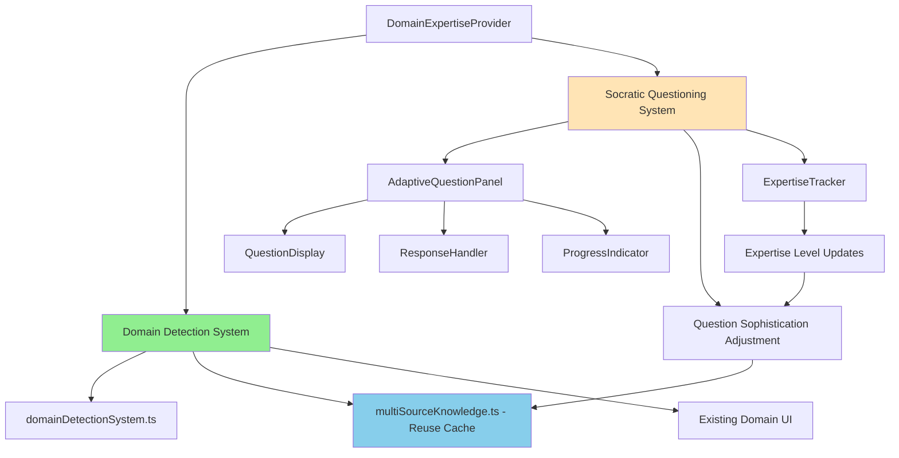

# Langflow Architect Brownfield Architecture: Epic 6.4.3 Advanced Socratic Questioning

## Change Log

| Change | Date | Version | Description | Author |
|--------|------|---------|-------------|--------|
| Initial Architecture | Aug 29, 2025 | 1.0 | Brownfield architecture for Epic 6.4.3 Advanced Socratic Questioning | Architect Agent (Winston) |

## 1. Introduction

### Enhancement Overview

This document defines the technical architecture for implementing Epic 6.4.3 Advanced Socratic Questioning within the existing Langflow Architect application. The enhancement adds adaptive questioning capabilities that dynamically adjust to user domain expertise while preserving the existing 92% accurate domain detection system (Epic 6.4.1).

### Architecture Goals

**Primary Objectives**:
- Integrate adaptive Socratic questioning without disrupting operational domain detection
- Maintain existing performance metrics (<3s response time, currently 2.1s average)
- Preserve all 11 existing CopilotKit actions functionality
- Implement progressive disclosure based on user expertise tracking
- Ensure graceful degradation when external services are unavailable

**Integration Philosophy**: Composition-based extension pattern that adds sophisticated questioning capabilities while maintaining zero modification to existing domain detection logic.

## 2. Current Project Analysis

### Existing System State

**Project Status**: 70% complete Next.js/TypeScript application with proven CopilotKit integration
**Foundation**: Epic 6.4.1 COMPLETED - Dynamic Domain Intelligence achieving 92% accuracy with <3s response time
**Current Architecture**: Standalone web application with sophisticated domain detection using multi-source knowledge aggregation

### Technology Stack Analysis

**Frontend Framework**: Next.js 15.5.0 with Turbopack, React 19.1.0
**Language**: TypeScript 5 (strict mode enabled)
**AI Integration**: CopilotKit 1.10.2 (Core, UI, Runtime packages)
**State Management**: React Context (`DomainExpertiseProvider`)
**Styling**: Tailwind CSS 4
**Infrastructure**: Vercel deployment platform, Node.js 18+
**External APIs**: OpenAI GPT-5, MCP servers (Microsoft Docs, CopilotKit), Tavily/DuckDuckGo search

### Performance Baseline

**Current Metrics**:

- Domain detection response time: 2.1s average (<3s requirement)
- Domain detection accuracy: 92% across multiple domains
- CopilotKit actions: 11 operational actions with established response patterns
- Multi-source knowledge queries: Cached for optimal performance

## 3. Enhancement Scope

### Feature Addition Scope

**Core Enhancement**: Adaptive Socratic questioning system with progressive disclosure
**Integration Depth**: Deep integration with existing domain detection and CopilotKit framework
**User Experience**: Natural integration with existing workflow patterns
**Performance Impact**: <500ms additional latency, <20% memory increase

### Integration Points

**Primary Integration**: Extension of existing `DomainExpertiseProvider` React context
**API Integration**: New CopilotKit actions following established 3-action pattern
**UI Integration**: Component composition with existing domain detection interface
**Knowledge Integration**: Leverage existing `multiSourceKnowledge.ts` caching

### Risk Assessment

**Technical Risks**: Questioning system interference with domain detection performance
**Integration Risks**: Context extension affecting existing domain state management
**Deployment Risks**: Feature rollout impact on existing user workflows
**Mitigation Strategy**: Feature flags, composition patterns, regression testing

## 4. Tech Stack Alignment

### Existing Stack Preservation

**No Changes Required**:

- Next.js 15.5.0 build and deployment process
- React 19.1.0 component architecture
- TypeScript 5 strict mode compilation
- Vercel platform deployment
- External API integrations (OpenAI, MCP servers, search APIs)

### Enhancement Stack Extensions

**New Dependencies**: None required - all functionality built with existing CopilotKit and React capabilities
**Development Dependencies**: Potential Jest test utilities for questioning component testing
**Configuration Extensions**: Environment variables for feature flags and debugging

### Performance Alignment

**Response Time Budget**: 500ms additional latency allowance for questioning features
**Memory Budget**: 20% increase allowance for questioning state management
**Caching Strategy**: Leverage existing multi-source knowledge caching for question enrichment
**Monitoring Strategy**: Browser-based performance tracking with alert thresholds

## 5. Data Models and State Management

### Core Data Models

#### SocraticQuestioningContext

```typescript
interface SocraticQuestioningContext {
  isActive: boolean;
  currentQuestion: AdaptiveQuestion | null;
  expertiseLevel: ExpertiseLevel;
  conversationHistory: QuestionSession[];
  progressIndicators: ProgressMetrics;
}
```

#### AdaptiveQuestion

```typescript
interface AdaptiveQuestion {
  id: string;
  text: string;
  sophisticationLevel: 1 | 2 | 3 | 4 | 5;
  domainContext: string;
  generatedAt: Date;
  responseOptions?: string[];
  followUpStrategy: FollowUpStrategy;
}
```

#### QuestionSession

```typescript
interface QuestionSession {
  sessionId: string;
  domainContext: string;
  questions: AdaptiveQuestion[];
  userResponses: UserResponse[];
  expertiseLevelProgression: ExpertiseLevel[];
  performanceMetrics: SessionMetrics;
}
```

#### ExpertiseLevel

```typescript
type ExpertiseLevel = 'novice' | 'intermediate' | 'advanced' | 'expert';

interface ExpertiseIndicators {
  level: ExpertiseLevel;
  confidence: number; // 0-1
  domainSpecificIndicators: Record<string, number>;
  progressionTrend: 'increasing' | 'stable' | 'decreasing';
}
```

### State Management Strategy

**Context Extension Pattern**:

```typescript
// Extend existing DomainExpertiseProvider
interface EnhancedDomainContext extends DomainExpertiseContext {
  questioningState: SocraticQuestioningContext;
  questioningActions: {
    generateQuestion: (context: DomainContext) => Promise<AdaptiveQuestion>;
    trackExpertise: (response: UserResponse) => ExpertiseLevel;
    updateProgression: (session: QuestionSession) => void;
  };
}
```

**Composition Approach**: New questioning state managed alongside existing domain state without modification to existing domain detection logic.

## 6. Component Architecture

### New Component Hierarchy

```
Enhanced Domain Intelligence System
├── DomainExpertiseProvider (Extended)
│   ├── Existing Domain Detection Components (Unchanged)
│   └── Socratic Questioning Components (New)
│       ├── AdaptiveQuestionPanel
│       │   ├── QuestionDisplay
│       │   ├── ResponseHandler
│       │   └── ProgressIndicator
│       ├── ExpertiseTracker
│       └── QuestionGenerationEngine
```

### Component Interaction Diagram



### Component Specifications

#### AdaptiveQuestionPanel

**Purpose**: Primary UI component for questioning interface
**Props**: `domainContext`, `expertiseLevel`, `onResponse`
**State**: Current question, response input, progress display
**Integration**: Follows existing domain component styling patterns

#### QuestionGenerationEngine

**Purpose**: Core questioning logic leveraging existing domain detection
**Dependencies**: `domainDetectionSystem.getActiveDomainContext()`, `multiSourceKnowledge.queryMultipleSources()`
**Output**: Contextually relevant questions without hardcoded domain logic

#### ExpertiseTracker

**Purpose**: Progressive disclosure and expertise level management
**Input**: User responses, domain indicators, conversation history
**Output**: Updated expertise level and sophistication recommendations

## 7. Source Tree Integration

### New Directory Structure

```
app/src/
├── lib/
│   ├── domain/              # Existing domain detection (unchanged)
│   │   ├── domainDetectionSystem.ts
│   │   ├── multiSourceKnowledge.ts
│   │   └── types.ts
│   └── enhanced/            # New questioning system
│       ├── questioning/
│       │   ├── questionGenerator.ts
│       │   ├── expertiseTracker.ts
│       │   ├── questionTypes.ts
│       │   └── questioningEngine.ts
│       └── hooks/
│           ├── useAdaptiveQuestioning.ts
│           ├── useExpertiseTracking.ts
│           └── useQuestionGeneration.ts
├── components/
│   ├── domain/              # Existing domain components (unchanged)
│   └── questioning/         # New questioning components
│       ├── AdaptiveQuestionPanel.tsx
│       ├── QuestionDisplay.tsx
│       ├── ResponseHandler.tsx
│       ├── ProgressIndicator.tsx
│       └── ExpertiseTracker.tsx
└── providers/
    └── DomainExpertiseProvider.tsx  # Extended with questioning context
```

### Integration Strategy

**File Modification Approach**: Extend existing `DomainExpertiseProvider` using composition pattern
**Import Strategy**: New questioning modules import existing domain detection utilities
**Naming Convention**: Maintain existing camelCase for functions, PascalCase for components
**Code Organization**: Clear separation between existing and new functionality

### Source Tree Impact

**Modified Files**:

- `providers/DomainExpertiseProvider.tsx` (extended with questioning context)
- `app/page.tsx` (integration of questioning UI components)

**New Files**: All files in `lib/enhanced/` and `components/questioning/` directories

**Unchanged Files**: All existing domain detection logic, CopilotKit action definitions, existing UI components

## 8. Infrastructure Considerations

### Deployment Infrastructure

**Current Infrastructure**: Vercel platform deployment with Next.js 15.5.0 and Turbopack bundling

**Epic 6.4.3 Infrastructure Approach**:

- **Zero Additional Infrastructure Requirements** - All questioning capabilities deploy within existing Next.js application bundle
- **Feature Flag Strategy** - Environment variable-based feature flags for safe rollout without infrastructure changes
- **Existing Build Process** - Standard Next.js production build handles all questioning system components

### Configuration Management

**Environment Variables for Safe Rollout**:

```
NEXT_PUBLIC_ENABLE_SOCRATIC_QUESTIONING=false  # Feature flag for gradual rollout
NEXT_PUBLIC_QUESTIONING_DEBUG_MODE=false      # Debug mode for development/testing
NEXT_PUBLIC_QUESTIONING_PERFORMANCE_LOG=false # Performance monitoring toggle
```

**API Key Management**: All existing API keys (OpenAI, Tavily, DuckDuckGo) remain unchanged - questioning system leverages existing external service connections

### Performance Monitoring Strategy

**Response Time Tracking**:

- Browser-based performance monitoring for questioning system response times
- Console logging for domain detection + questioning combined latency
- Alert thresholds: Warn if combined response time exceeds 2.5s, critical if exceeds 3s

**Memory Usage Monitoring**:

- Client-side memory tracking for questioning state management
- Baseline comparison against current domain detection memory footprint
- Target: <20% memory increase with questioning active

### Rollback and Safety Infrastructure

**Feature Flag Rollback**: Instant disable capability through environment variable change
**Graceful Degradation**: System continues full domain detection functionality with questioning disabled
**Performance Circuit Breaker**: Automatic questioning disable if response times exceed thresholds

## 9. Testing Strategy - Regression-First Approach

### Existing System Preservation Testing

**Priority 1: Domain Detection Regression Tests**

- Validate existing 92% domain detection accuracy remains unchanged
- Test all domain detection APIs (`domainDetectionSystem.analyzeUserContext`, `domainDetectionSystem.activateDomainExpertise`) return identical responses
- Performance regression testing: maintain 2.1s average response time baseline

**Priority 2: CopilotKit Action Preservation**

- Test all 11 existing CopilotKit actions maintain functionality
- Validate action response structures remain unchanged
- Ensure action performance baselines are preserved

**Priority 3: React Context State Management**

- Test existing `DomainExpertiseProvider` functionality remains intact
- Validate domain switching behavior continues normally
- Ensure UI state management patterns remain consistent

### New Feature Integration Testing

**Questioning System Component Tests**

- Unit tests for `AdaptiveQuestionPanel`, `QuestionResponseHandler`, `QuestionProgressIndicator`
- Integration tests for questioning state with existing domain context
- Performance tests for question generation (<500ms additional latency)

**End-to-End Workflow Testing**

- Complete user journey: domain detection → question generation → progressive disclosure
- Fallback scenario testing when MCP servers unavailable
- Memory usage validation (<20% increase from baseline)

### Testing Framework Integration

**Unit Testing**: Jest with React Testing Library for component testing
**Integration Testing**: Playwright E2E tests following existing patterns in `__tests__/` directory
**Performance Testing**: Custom performance monitoring with browser APIs
**Regression Testing**: Automated test suite validating existing functionality preservation

## 10. Security Integration

### Existing Security Measures Preservation

**Authentication**: No changes - existing Vercel deployment authentication patterns maintained
**Authorization**: No changes - client-side React application security model unchanged  
**Data Protection**: Enhanced privacy - questioning conversations remain client-side only, no additional data storage
**Security Tools**: Existing ESLint security rules and TypeScript strict mode compliance maintained

### Enhancement Security Requirements

**New Security Measures**: Input validation for user responses to questioning system, sanitization of generated questions
**Integration Points**: Secure extension of existing `DomainExpertiseProvider` context without exposing sensitive domain data
**Compliance Requirements**: Maintain existing data privacy standards, no additional compliance requirements

### Security Testing

**Existing Security Tests**: All current security measures continue unchanged
**New Security Test Requirements**: Input validation testing for questioning system, XSS prevention for generated question content
**Penetration Testing**: No additional requirements - questioning system operates within existing security boundary

## 11. Next Steps and Handoff

### Story Manager Handoff

**Epic 6.4.3 Implementation Guidance for Story Manager:**

You have comprehensive planning documentation ready for story implementation:

**Reference Documents**:

- PRD: `docs/brownfield-prd-epic-6.4.3.md` (5-story implementation sequence)
- Architecture: `docs/brownfield-architecture.md` (complete technical blueprint) 

**Key Integration Requirements**:

- Preserve existing 92% domain detection accuracy and <3s response time
- Use composition pattern extending `DomainExpertiseProvider` without modification
- New questioning modules in `app/src/lib/enhanced/` directory
- Maintain all 11 existing CopilotKit actions functionality

**Implementation Sequence**:

1. **Story 1.1**: System Discovery and Safe Integration Foundation
2. **Story 1.2**: Adaptive Question Generation Engine  
3. **Story 1.3**: Progressive Disclosure and Expertise Tracking
4. **Story 1.4**: User Interface Integration and Experience
5. **Story 1.5**: CopilotKit Action Enhancement and Performance Optimization

**First Story Focus**: Start with Story 1.1 for safe integration foundation before building questioning features.

### Developer Handoff

**Epic 6.4.3 Development Guidance:**

**Architecture Reference**: This document provides complete technical implementation blueprint including:

- Component interaction diagrams and data models
- Source tree integration strategy (`lib/enhanced/` directory structure)
- Performance constraints and compatibility requirements

**Integration Requirements**:

- Extend existing domain detection without modification to core `domainDetectionSystem.ts`
- Follow established TypeScript A- grade standards and ESLint configuration
- Use existing CopilotKit action patterns for questioning functionality
- Implement feature flags for safe rollout capability

**Key Technical Decisions**:

- Composition-based architecture extending `DomainExpertiseProvider`
- React Context state management for questioning state (no database changes)
- Leverage existing `multiSourceKnowledge.ts` caching for question enrichment
- Progressive disclosure UI following existing domain confidence display patterns

**Implementation Sequencing**:

1. Create questioning state management in `DomainExpertiseProvider` extension
2. Build question generation engine using existing domain detection context
3. Implement progressive disclosure and expertise tracking
4. Create questioning UI components following existing design patterns
5. Add CopilotKit actions for questioning capabilities

---

## Architecture Document Status: Complete

This comprehensive brownfield architecture document provides the technical foundation for safe implementation of Epic 6.4.3 Advanced Socratic Questioning while preserving the integrity and performance of the existing domain detection system. The composition-based approach ensures zero disruption to operational functionality while adding sophisticated questioning capabilities.

**Next Step**: Proceed to PO validation phase to review all planning documents before beginning story implementation.
