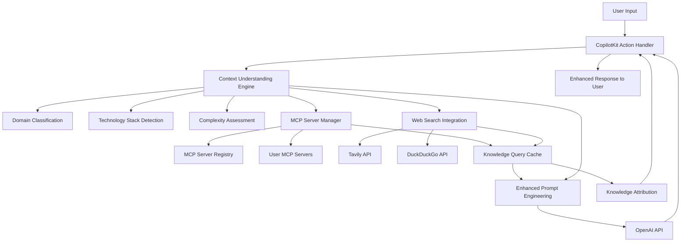

# Socratic Langflow Architect Brownfield Enhancement Architecture

## Introduction

This document outlines the architectural approach for enhancing Socratic Langflow Architect with **Web Search Integration and Dynamic MCP Server Setup**. Its primary goal is to serve as the guiding architectural blueprint for AI-driven development of new features while ensuring seamless integration with the existing system.

**Relationship to Existing Architecture:**
This document supplements existing project architecture by defining how new components will integrate with current systems. Where conflicts arise between new and existing patterns, this document provides guidance on maintaining consistency while implementing enhancements.

### Existing Project Analysis

#### Current Project State
- **Primary Purpose:** Socratic AI architect application for generating Langflow workflows through intelligent questioning and guidance using CopilotKit
- **Current Tech Stack:** Next.js 15.5.0 + CopilotKit 1.10.2 + OpenAI GPT integration with TypeScript and Tailwind CSS
- **Architecture Style:** Component-based React application with CopilotKit chat interface and action system
- **Deployment Method:** Vercel-optimized Next.js application with API routes for CopilotKit backend

#### Available Documentation
- Technical specification document defining enhanced agent architecture
- API documentation covering existing CopilotKit actions
- Testing documentation with E2E test coverage (10/10 passing)
- Implementation roadmap with phased development approach
- BMad method integration for workflow coordination

#### Identified Constraints
- Must maintain existing CopilotKit action patterns and API structure
- Cannot break existing E2E test coverage during enhancement
- Need to preserve current conversation flow and user experience
- OpenAI API usage patterns and rate limiting considerations
- Existing Next.js deployment pipeline and Vercel compatibility requirements

## Enhancement Scope and Integration Strategy

### Enhancement Overview
**Enhancement Type:** Intelligent Agent Capability Extension  
**Scope:** Add web search integration (Tavily/DuckDuckGo) and dynamic MCP server communication to existing CopilotKit actions for context-aware responses  
**Integration Impact:** Medium - Extends existing action system without breaking current functionality

### Integration Approach
**Code Integration Strategy:** Extend existing CopilotKit actions with new web search and MCP capabilities while maintaining backward compatibility  
**Database Integration:** File-based JSON knowledge base integration with existing static data patterns  
**API Integration:** Add new external API calls (Tavily, DuckDuckGo, MCP servers) to existing `/api/copilotkit` endpoint  
**UI Integration:** Enhance existing CopilotSidebar with real-time search indicators and knowledge source attribution

### Compatibility Requirements
- **Existing API Compatibility:** All current CopilotKit actions (`analyze_workflow_requirements`, `generate_workflow_questions`, `generate_langflow_json`) must continue working unchanged
- **Database Schema Compatibility:** New knowledge base files will supplement existing JSON patterns without modifying current data structures  
- **UI/UX Consistency:** Enhanced responses will appear within existing chat interface with clear attribution for external knowledge sources
- **Performance Impact:** Target <2 second response time for enhanced queries with graceful fallback to existing functionality if external services are unavailable

## Tech Stack Alignment

### Existing Technology Stack

| Category | Current Technology | Version | Usage in Enhancement | Notes |
|----------|-------------------|---------|---------------------|-------|
| **Frontend Framework** | Next.js | 15.5.0 | Foundation for enhanced actions | Maintained as primary framework |
| **AI Integration** | CopilotKit | 1.10.2 | Enhanced with web search/MCP tools | Core integration point |
| **Language Model** | OpenAI GPT | Latest API | Enhanced prompts with external context | Existing integration maintained |
| **UI Components** | React + TypeScript | 18+ | Enhanced chat interface indicators | Current component patterns |
| **Styling** | Tailwind CSS | Latest | Visual indicators for knowledge sources | Existing design system |
| **API Routes** | Next.js API Routes | 15.5.0 | Extended for external API calls | `/api/copilotkit` enhanced |
| **Testing** | Playwright | Latest | Enhanced E2E tests for new features | Current test patterns extended |
| **Deployment** | Vercel | Latest | Same deployment with env variables | Existing pipeline maintained |

### New Technology Additions

| Technology | Version | Purpose | Rationale | Integration Method |
|------------|---------|---------|-----------|-------------------|
| **Tavily API** | v1 | Enterprise web search | Professional search with domain-specific focus | HTTP client in API routes |
| **DuckDuckGo API** | Latest | Fallback web search | Free alternative with privacy focus | HTTP client with fallback logic |
| **Dynamic MCP Client** | Latest | **User-configurable MCP servers** | **Flexible access to domain-specific knowledge sources** | **WebSocket/HTTP client with dynamic server registration** |
| **MCP Server Registry** | Custom | **User MCP server management** | **Allow users to add/configure their own MCP servers** | **JSON-based registry with validation** |
| **Knowledge Base** | File-based JSON | Static domain patterns | Fallback knowledge when MCP unavailable | Static JSON files in `/knowledge` |

### Enhanced MCP Integration Architecture

**User-Configurable MCP Server Support:**
```typescript
interface MCPServerConfig {
  id: string;                    // "microsoft-docs", "healthcare-guidelines", "aws-docs"
  name: string;                  // Display name for user
  description: string;           // What this MCP server provides
  endpoint: string;              // WebSocket or HTTP endpoint
  capabilities: string[];        // ["documentation", "best-practices", "code-examples"]
  domains: string[];             // ["healthcare", "finance", "general"]
  authMethod: "none" | "api-key" | "oauth";
  isActive: boolean;
  userAdded: boolean;            // vs. system-provided
}
```

## Data Models and Schema Changes

### New Data Models

#### Model 1: MCP Server Configuration
**Purpose:** Store user-configurable MCP server configurations for dynamic knowledge source management  
**Integration:** Extends existing JSON-based data patterns, persisted alongside current workflow templates

**Key Attributes:**
- **id**: string - Unique identifier for MCP server
- **name**: string - User-friendly display name
- **endpoint**: string - WebSocket or HTTP endpoint URL for MCP communication
- **capabilities**: string[] - Available capabilities
- **domains**: string[] - Applicable domains
- **authConfig**: object - Authentication configuration
- **isActive**: boolean - Whether server is currently enabled for queries
- **userAdded**: boolean - Distinguishes user-added vs. system-provided servers

**Relationships:**
- **With Existing:** Integrates with current conversation context and user preferences
- **With New:** Links to ConversationContext and KnowledgeQuery models

#### Model 2: Enhanced Conversation Context
**Purpose:** Track enhanced conversation state including domain analysis, MCP server usage, and search history  
**Integration:** Extends existing conversation tracking with intelligent context building

**Key Attributes:**
- **conversationId**: string - Unique conversation identifier
- **domainAnalysis**: object - Detected domain, technology stack, complexity assessment
- **activeMCPServers**: string[] - Currently active MCP server IDs for this conversation
- **searchHistory**: object[] - Web search queries and results for context building
- **knowledgeSources**: object[] - Attribution for external knowledge used in responses
- **contextEvolution**: object[] - How understanding deepened through conversation

**Relationships:**
- **With Existing:** Builds on current CopilotKit conversation state management
- **With New:** Primary relationship with MCP servers and knowledge queries

#### Model 3: Knowledge Query and Response
**Purpose:** Track external knowledge queries and responses for caching and attribution  
**Integration:** Caching layer for external API calls with attribution for user transparency

**Key Attributes:**
- **queryId**: string - Unique identifier for knowledge query
- **sourceType**: string - Type of knowledge source ("mcp", "web-search", "static-knowledge")
- **sourceId**: string - Specific source identifier
- **query**: string - The actual query sent to external source
- **response**: object - Structured response from external source
- **timestamp**: datetime - When query was made
- **relevanceScore**: number - AI-assessed relevance to conversation context

**Relationships:**
- **With Existing:** Links to conversation history and generated responses
- **With New:** Connected to MCP servers and conversation context

### Schema Integration Strategy
**Database Changes Required:**
- **New Tables:** `mcp_servers`, `conversation_contexts`, `knowledge_queries`, `domain_patterns`
- **Modified Tables:** `conversations` (add reference to enhanced context), `user_preferences` (add MCP server preferences)
- **New Indexes:** Domain-based server selection, cache management, conversation context lookup
- **Migration Strategy:** Gradual rollout with existing conversations maintaining current behavior

**Backward Compatibility:**
- All existing conversation data remains functional with current schema
- New fields are optional and default to existing behavior when not present
- Enhanced features activate only when users configure MCP servers
- Existing CopilotKit actions continue working unchanged during migration period

## Component Architecture

### New Components

#### Component 1: Context Understanding Engine
**Responsibility:** Analyze user input to identify domain, technology stack, complexity, and integration patterns for intelligent response generation  
**Integration Points:** Integrates with existing CopilotKit action processing pipeline and conversation state management

**Key Interfaces:**
- `analyzeUserInput(message: string, history: Message[]): Promise<ContextAnalysis>`
- `classifyDomain(input: string): DomainContext`
- `detectTechnologyStack(input: string): TechStackContext[]`
- `assessComplexity(requirements: string): ComplexityAssessment`

**Dependencies:**
- **Existing Components:** CopilotKit runtime, OpenAI API client, conversation history storage
- **New Components:** Knowledge Base Manager, MCP Server Registry

**Technology Stack:** TypeScript, OpenAI function calling, pattern matching algorithms, domain classification models

#### Component 2: Dynamic MCP Server Manager
**Responsibility:** Manage user-configurable MCP servers, handle server registration, selection, and communication  
**Integration Points:** Extends existing API route structure with MCP communication capabilities

**Key Interfaces:**
- `registerMCPServer(config: MCPServerConfig): Promise<boolean>`
- `selectRelevantServers(context: ContextAnalysis): MCPServerConfig[]`
- `queryMCPServer(serverId: string, query: string): Promise<MCPResponse>`
- `validateServerConnection(config: MCPServerConfig): Promise<boolean>`

**Dependencies:**
- **Existing Components:** Next.js API routes, environment configuration, error handling
- **New Components:** Context Understanding Engine, Knowledge Query Cache

**Technology Stack:** WebSocket clients, HTTP clients, MCP protocol implementation, server validation logic

#### Component 3: Enhanced Prompt Engineering System
**Responsibility:** Generate context-aware prompts and responses using domain-specific knowledge and external data sources  
**Integration Points:** Replaces generic prompt generation in existing CopilotKit actions

**Key Interfaces:**
- `generateContextualPrompt(context: ContextAnalysis, mcpData: any[]): string`
- `enhanceSystemMessage(domain: string, techStack: string[]): string`
- `createFollowUpQuestions(context: ContextAnalysis): Question[]`
- `generateComplianceAlerts(domain: string, requirements: string): Alert[]`

**Dependencies:**
- **Existing Components:** OpenAI API integration, CopilotKit conversation management
- **New Components:** Context Understanding Engine, Knowledge Base Manager, MCP Server Manager

**Technology Stack:** Template engine, domain-specific prompt libraries, compliance rule engines

#### Component 4: Web Search Integration Manager
**Responsibility:** Coordinate web search queries across multiple search providers with intelligent fallback and result aggregation  
**Integration Points:** Integrates with existing CopilotKit actions to provide real-time knowledge enhancement

**Key Interfaces:**
- `searchWithFallback(query: string, domain: string): Promise<SearchResults>`
- `aggregateSearchResults(results: SearchResult[]): AggregatedResults`
- `validateSearchRelevance(results: SearchResult[], context: ContextAnalysis): number`
- `formatSearchAttribution(sources: SearchSource[]): Attribution[]`

**Dependencies:**
- **Existing Components:** API route infrastructure, caching mechanisms
- **New Components:** Context Understanding Engine, Knowledge Query Cache

**Technology Stack:** Tavily API client, DuckDuckGo API client, result aggregation algorithms, relevance scoring

#### Component 5: Knowledge Query Cache and Attribution
**Responsibility:** Cache external knowledge queries for performance and provide transparent attribution of knowledge sources  
**Integration Points:** Middleware layer for all external knowledge requests with attribution in CopilotKit responses

**Key Interfaces:**
- `cacheQuery(query: KnowledgeQuery): Promise<void>`
- `getCachedResult(queryHash: string): Promise<CachedResult | null>`
- `trackKnowledgeUsage(queryId: string, conversationId: string): void`
- `generateAttribution(sources: KnowledgeSource[]): AttributionData`

**Dependencies:**
- **Existing Components:** File system or database storage, conversation tracking
- **New Components:** MCP Server Manager, Web Search Integration Manager

**Technology Stack:** Caching algorithms, query hashing, attribution tracking, storage management

### Component Interaction Diagram



## API Design and Integration

### Enhanced CopilotKit Endpoint Specifications

#### Extended `/api/copilotkit` Endpoint
**Current Functionality:** Handles CopilotKit chat interface and action processing  
**Enhancement:** Add optional web search and MCP server integration parameters

**Enhanced Request Parameters:**
```typescript
interface EnhancedCopilotKitRequest {
  // Existing CopilotKit parameters maintained
  messages: Message[];
  action?: string;
  
  // New enhancement parameters (optional for backward compatibility)
  searchEnabled?: boolean;           // Enable web search integration
  mcpServersEnabled?: string[];      // Array of MCP server IDs to use
  domainContext?: string;            // Explicit domain override
  complexityLevel?: "simple" | "moderate" | "complex";
  includeAttribution?: boolean;      // Include knowledge source attribution
}
```

**Enhanced Response Format:**
```typescript
interface EnhancedCopilotKitResponse {
  // Existing CopilotKit response structure maintained
  response: string;
  
  // New enhancement data (only present when enhancements are used)
  enhancement?: {
    knowledgeSources: KnowledgeSource[];
    domainAnalysis: ContextAnalysis;
    mcpServersUsed: string[];
    searchQueriesExecuted: SearchQuery[];
    confidence: number;              // AI confidence in enhanced response
  };
}
```

#### New MCP Server Management Actions

**Action: `manage_mcp_servers`**
```typescript
interface MCPServerManagementAction {
  type: "add" | "remove" | "list" | "test";
  serverConfig?: MCPServerConfig;    // For add operation
  serverId?: string;                 // For remove/test operations
}
```

**Action: `configure_domain_mapping`**
```typescript
interface DomainMappingAction {
  domain: string;                    // "healthcare", "finance", etc.
  preferredMCPServers: string[];     // Server IDs to prioritize for this domain
  searchPreferences: {
    enableWebSearch: boolean;
    searchProviders: ("tavily" | "duckduckgo")[];
    resultCount: number;
  };
}
```

### External API Integration Patterns

#### Tavily Search API Integration
**Endpoint:** `https://api.tavily.com/search`  
**Authentication:** API Key via headers  
**Rate Limiting:** Implemented with exponential backoff  

```typescript
interface TavilySearchRequest {
  query: string;
  search_depth: "basic" | "advanced";
  include_domains?: string[];        // Domain-specific search when available
  exclude_domains?: string[];        // Filter out low-quality sources
  max_results: number;               // Default: 5 for performance
}
```

#### DuckDuckGo API Integration (Fallback)
**Endpoint:** DuckDuckGo Instant Answer API  
**Authentication:** None required  
**Rate Limiting:** Built-in request throttling  

```typescript
interface DuckDuckGoRequest {
  q: string;                         // Search query
  format: "json";
  pretty: 1;
  no_redirect: 1;
  skip_disambig: 1;
}
```

#### Dynamic MCP Server Communication
**Protocol:** WebSocket or HTTP depending on server capabilities  
**Authentication:** Configurable per server (API key, OAuth, none)  
**Connection Management:** Pool with automatic reconnection  

```typescript
interface MCPServerConnection {
  serverId: string;
  connectionType: "websocket" | "http";
  endpoint: string;
  authConfig: MCPAuthConfig;
  status: "connected" | "disconnected" | "error";
  lastPing: Date;
}
```

### Error Handling and Fallback Strategies

#### Progressive Enhancement Fallback Chain
1. **Full Enhancement:** MCP servers + web search + context analysis
2. **Partial Enhancement:** Web search only if MCP servers unavailable
3. **Basic Enhancement:** Context analysis with static knowledge base
4. **Fallback to Existing:** Original CopilotKit behavior if all enhancements fail

#### Error Response Patterns
```typescript
interface EnhancementError {
  component: "mcp" | "search" | "context";
  error: string;
  fallbackUsed: boolean;
  impactLevel: "none" | "partial" | "full";
}
```

## Source Tree Integration

### New Directory Structure

```
src/
├── components/                    # Existing React components
│   ├── CopilotSidebar.tsx        # Enhanced with attribution display
│   └── enhanced/                 # New enhancement UI components
│       ├── KnowledgeAttribution.tsx
│       ├── MCPServerStatus.tsx
│       └── DomainContext.tsx
├── lib/                          # Existing utility libraries
│   ├── openai.ts                 # Enhanced with context prompts
│   └── enhanced/                 # New enhancement libraries
│       ├── contextEngine.ts      # Context Understanding Engine
│       ├── mcpManager.ts         # MCP Server Management
│       ├── searchManager.ts      # Web Search Integration
│       └── knowledgeCache.ts     # Caching and Attribution
├── pages/api/                    # Existing API routes
│   ├── copilotkit.ts            # Enhanced with new capabilities
│   └── enhanced/                 # New API endpoints
│       ├── mcp-servers.ts        # MCP server management
│       └── domain-config.ts      # Domain-specific configuration
├── knowledge/                    # New static knowledge base
│   ├── domains/                  # Domain-specific patterns
│   │   ├── healthcare.json
│   │   ├── finance.json
│   │   └── technology.json
│   └── patterns/                 # Common architecture patterns
│       ├── compliance.json
│       └── integration.json
└── config/                       # Existing configuration
    ├── mcp-servers.json          # Default MCP server configurations
    └── domain-mappings.json      # Domain to server mappings
```

### File Modification Strategy

#### Modified Files
- **`src/components/CopilotSidebar.tsx`**: Add knowledge source attribution display
- **`src/lib/openai.ts`**: Enhance prompt generation with external context
- **`src/pages/api/copilotkit.ts`**: Integrate new enhancement capabilities
- **`package.json`**: Add new dependencies (WebSocket client, search APIs)
- **`next.config.js`**: Add environment variable configuration for new APIs

#### New Files Created
- **Context Engine**: `src/lib/enhanced/contextEngine.ts`
- **MCP Management**: `src/lib/enhanced/mcpManager.ts`
- **Search Integration**: `src/lib/enhanced/searchManager.ts`
- **Knowledge Cache**: `src/lib/enhanced/knowledgeCache.ts`
- **API Routes**: `src/pages/api/enhanced/mcp-servers.ts`
- **Configuration**: `config/mcp-servers.json`, `knowledge/domains/*.json`

#### Integration Testing Files
- **Enhanced E2E Tests**: `__tests__/e2e/enhanced-integration.spec.ts`
- **MCP Server Tests**: `__tests__/e2e/mcp-server-management.spec.ts`
- **Search Integration Tests**: `__tests__/e2e/web-search-integration.spec.ts`

### Version Control Integration

#### Branching Strategy
- **Feature Branch**: `feature/web-search-mcp-integration`
- **Development Branch**: `develop` (for integration testing)
- **Main Branch**: `main` (for production deployment)

#### Migration Path
1. **Phase 1**: Add new files without modifying existing functionality
2. **Phase 2**: Enhance existing files with backward-compatible changes
3. **Phase 3**: Enable new features via feature flags
4. **Phase 4**: Full activation with comprehensive testing

## Infrastructure and Deployment

### Environment Configuration

#### Required Environment Variables
```bash
# Web Search API Keys
TAVILY_API_KEY=your_tavily_api_key_here
DUCKDUCKGO_API_ENABLED=true

# MCP Server Configuration
MCP_SERVERS_CONFIG_PATH=/config/mcp-servers.json
MCP_CONNECTION_TIMEOUT=30000
MCP_MAX_CONNECTIONS=10

# Knowledge Base Settings
KNOWLEDGE_CACHE_TTL=3600          # 1 hour cache TTL
KNOWLEDGE_BASE_PATH=/knowledge
ENABLE_STATIC_FALLBACK=true

# Feature Flags
ENABLE_WEB_SEARCH=true
ENABLE_MCP_INTEGRATION=true
ENABLE_ENHANCED_PROMPTS=true
```

#### Vercel Deployment Configuration
```json
{
  "env": {
    "TAVILY_API_KEY": "@tavily-api-key",
    "ENABLE_WEB_SEARCH": "true",
    "ENABLE_MCP_INTEGRATION": "true"
  },
  "functions": {
    "pages/api/copilotkit.js": {
      "maxDuration": 30
    },
    "pages/api/enhanced/mcp-servers.js": {
      "maxDuration": 15
    }
  }
}
```

### Performance Considerations

#### Caching Strategy
- **Knowledge Queries**: 1-hour TTL for external API responses
- **MCP Server Status**: 5-minute TTL for connection health checks
- **Domain Analysis**: Session-based caching for conversation context
- **Search Results**: 30-minute TTL with relevance-based invalidation

#### Resource Optimization
- **Lazy Loading**: MCP connections established only when needed
- **Request Batching**: Multiple knowledge queries combined when possible
- **Connection Pooling**: Reuse MCP server connections across requests
- **Graceful Degradation**: Fallback to simpler functionality under load

### Monitoring and Observability

#### Key Metrics
- **Enhancement Success Rate**: Percentage of enhanced responses vs. fallbacks
- **MCP Server Availability**: Uptime and response time for configured servers
- **Search API Performance**: Response times and error rates for Tavily/DuckDuckGo
- **Knowledge Cache Hit Rate**: Efficiency of caching layer
- **User Satisfaction**: Quality ratings for enhanced responses

#### Logging Strategy
```typescript
interface EnhancementLog {
  timestamp: Date;
  conversationId: string;
  enhancementType: "mcp" | "search" | "context";
  success: boolean;
  responseTime: number;
  fallbackUsed?: string;
  errorDetails?: string;
}
```

## Coding Standards and Patterns

### TypeScript Implementation Standards

#### Interface Design Patterns
```typescript
// Consistent error handling
interface EnhancementResult<T> {
  success: boolean;
  data?: T;
  error?: EnhancementError;
  fallbackUsed: boolean;
  metadata: {
    processingTime: number;
    sourceAttribution: string[];
  };
}

// Composable enhancement functions
type EnhancementFunction<T, R> = (
  input: T,
  context: ContextAnalysis
) => Promise<EnhancementResult<R>>;
```

#### Error Handling Standards
```typescript
// Graceful degradation pattern
async function enhanceWithFallback<T>(
  primaryFunction: () => Promise<T>,
  fallbackFunction: () => Promise<T>,
  errorContext: string
): Promise<T> {
  try {
    return await primaryFunction();
  } catch (error) {
    console.warn(`Enhancement failed for ${errorContext}, using fallback:`, error);
    return await fallbackFunction();
  }
}
```

### Code Organization Principles

#### Dependency Injection Pattern
```typescript
interface EnhancementDependencies {
  mcpManager: MCPServerManager;
  searchManager: WebSearchManager;
  contextEngine: ContextUnderstandingEngine;
  knowledgeCache: KnowledgeCache;
}

class EnhancedCopilotKitHandler {
  constructor(private deps: EnhancementDependencies) {}
  
  async processEnhancedAction(action: CopilotKitAction): Promise<EnhancedResponse> {
    // Implementation with injected dependencies
  }
}
```

#### Configuration Management
```typescript
interface EnhancementConfig {
  searchProviders: {
    tavily: { apiKey: string; maxResults: number };
    duckduckgo: { enabled: boolean; timeout: number };
  };
  mcpServers: MCPServerConfig[];
  caching: {
    ttl: number;
    maxSize: number;
    strategy: "lru" | "fifo";
  };
}
```

### Testing Standards

#### Integration Test Patterns
```typescript
describe("Enhanced CopilotKit Integration", () => {
  beforeEach(async () => {
    // Setup test MCP servers and mock external APIs
    await setupTestEnvironment();
  });

  test("should enhance healthcare queries with relevant MCP data", async () => {
    const query = "Create a HIPAA-compliant workflow for patient data processing";
    const result = await enhancedCopilotKit.processQuery(query);
    
    expect(result.enhancement?.mcpServersUsed).toContain("healthcare-compliance");
    expect(result.enhancement?.knowledgeSources).toHaveLength(2);
    expect(result.response).toContain("HIPAA");
  });
});
```

## Testing Strategy

### Enhanced E2E Testing

#### New Test Scenarios
1. **Web Search Integration Tests**
   - Verify Tavily API integration with healthcare domain queries
   - Test DuckDuckGo fallback when Tavily is unavailable
   - Validate search result attribution in responses

2. **MCP Server Management Tests**
   - Test dynamic MCP server registration and removal
   - Verify domain-based server selection logic
   - Test connection pooling and error recovery

3. **Context Understanding Tests**
   - Validate domain classification accuracy
   - Test technology stack detection
   - Verify progressive context building through conversation

4. **Knowledge Attribution Tests**
   - Ensure all external knowledge sources are properly attributed
   - Test cache hit rates and performance
   - Validate fallback to static knowledge base

#### Performance Testing
```typescript
test("enhanced responses should complete within 2 seconds", async () => {
  const startTime = Date.now();
  const result = await enhancedCopilotKit.processQuery(complexHealthcareQuery);
  const responseTime = Date.now() - startTime;
  
  expect(responseTime).toBeLessThan(2000);
  expect(result.enhancement?.confidence).toBeGreaterThan(0.8);
});
```

### Backward Compatibility Testing

#### Existing Functionality Validation
```typescript
describe("Backward Compatibility", () => {
  test("all existing CopilotKit actions work unchanged", async () => {
    const existingActions = [
      "analyze_workflow_requirements",
      "generate_workflow_questions", 
      "generate_langflow_json"
    ];
    
    for (const action of existingActions) {
      const result = await copilotKit.executeAction(action, testData);
      expect(result.success).toBe(true);
    }
  });
});
```

### Load Testing Strategy

#### Concurrent User Simulation
- **Test Scenario**: 50 concurrent users with enhanced features enabled
- **Performance Targets**: 95% of requests complete within 3 seconds
- **Resource Monitoring**: MCP connection pool efficiency, cache hit rates
- **Fallback Testing**: Graceful degradation under high load

## Security Integration

### API Security Enhancements

#### Authentication and Authorization
```typescript
interface MCPServerAuth {
  type: "none" | "api-key" | "oauth" | "mutual-tls";
  credentials?: {
    apiKey?: string;
    oauthToken?: string;
    clientCert?: string;
  };
  rotationSchedule?: string;    // For automatic key rotation
}
```

#### Input Validation and Sanitization
```typescript
function validateMCPServerConfig(config: MCPServerConfig): ValidationResult {
  // Validate endpoint URLs to prevent SSRF attacks
  if (!isValidURL(config.endpoint) || isInternalIP(config.endpoint)) {
    return { valid: false, error: "Invalid or internal endpoint" };
  }
  
  // Sanitize user-provided configuration
  return { valid: true, sanitized: sanitizeConfig(config) };
}
```

### External API Security

#### Rate Limiting and DoS Protection
```typescript
class RateLimitedSearchManager {
  private rateLimiter = new Map<string, number>();
  
  async searchWithRateLimit(query: string, userId: string): Promise<SearchResults> {
    if (this.isRateLimited(userId)) {
      throw new Error("Rate limit exceeded");
    }
    
    return await this.executeSearch(query);
  }
}
```

#### Data Privacy and Compliance
```typescript
interface PrivacyConfig {
  logRetentionDays: number;      // How long to keep query logs
  anonymizeQueries: boolean;     // Remove PII from logged queries  
  encryptCache: boolean;         // Encrypt cached responses
  gdprCompliant: boolean;        // Enable GDPR data handling
}
```

### MCP Server Security

#### Connection Validation
- **Certificate Validation**: Verify SSL certificates for HTTPS/WSS connections
- **Endpoint Allowlisting**: Restrict MCP servers to approved domains
- **Content Filtering**: Scan MCP responses for malicious content
- **Timeout Protection**: Prevent hanging connections from blocking the system

---

**Change Log**

| Change | Date | Version | Description | Author |
|--------|------|---------|-------------|--------|
| Initial Creation | 2025-08-26 | 1.0 | Created brownfield enhancement architecture for web search and MCP integration | Winston (BMad Architect) |
| Completed Architecture | 2025-08-26 | 1.1 | Added API design, source tree, infrastructure, testing, and security sections | Winston (BMad Architect) |
