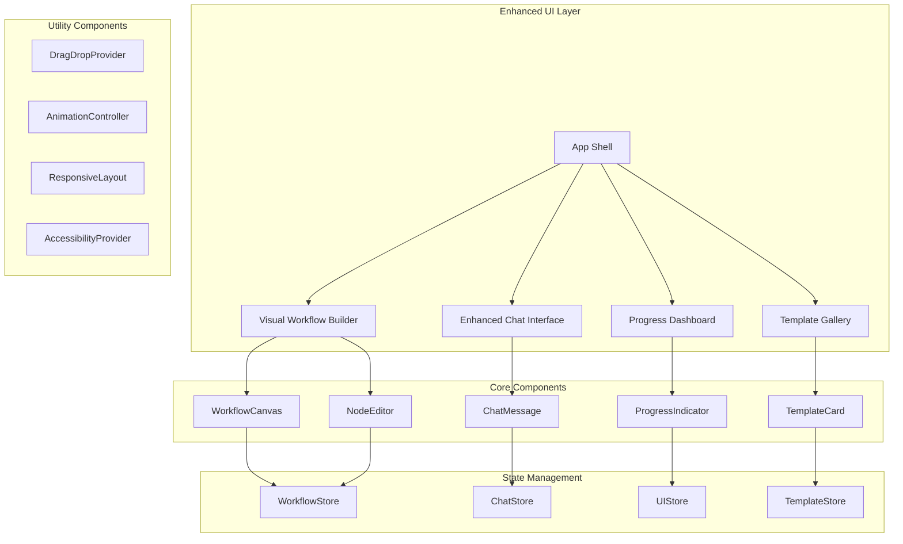

# Socratic Langflow Architect - UI/UX Enhancement Architecture

## 1. Enhancement Architecture Overview

This document extends the existing `architecture-standalone.md` to cover the new UI/UX enhancement components and patterns. Building on the solid Next.js + CopilotKit foundation, this architecture introduces advanced visual components, state management patterns, and performance optimizations.

### 1.1 Enhancement Architecture Principles

- **Component Composition**: Modular UI components with clear separation of concerns
- **State Management**: Predictable state flow with optimistic updates
- **Performance First**: 60fps animations with efficient rendering
- **Accessibility by Design**: WCAG 2.1 AA compliance from ground up
- **Progressive Enhancement**: Core functionality works without advanced features

## 2. Enhanced Frontend Architecture

### 2.1 Component Architecture



### 2.2 Visual Workflow Builder Architecture

**Core Components**:

```typescript
// Workflow Canvas Component
interface WorkflowCanvasProps {
  workflow: Workflow;
  onNodeUpdate: (nodeId: string, updates: NodeUpdate) => void;
  onConnectionCreate: (connection: Connection) => void;
  readOnly?: boolean;
  showMinimap?: boolean;
}

// Node Editor Component
interface NodeEditorProps {
  node: WorkflowNode;
  onUpdate: (updates: NodeUpdate) => void;
  onDelete: () => void;
  schema: NodeSchema;
  validationErrors?: ValidationError[];
}

// Workflow Store (Zustand)
interface WorkflowStore {
  // State
  workflow: Workflow | null;
  selectedNode: string | null;
  draggedNode: string | null;
  
  // Actions
  updateNode: (nodeId: string, updates: NodeUpdate) => void;
  addNode: (node: WorkflowNode) => void;
  deleteNode: (nodeId: string) => void;
  createConnection: (connection: Connection) => void;
  setSelectedNode: (nodeId: string | null) => void;
}
```

**Canvas Rendering Strategy**:
- **SVG-based**: Scalable vector graphics for crisp rendering at all zoom levels
- **Virtualization**: Only render visible nodes for performance with large workflows
- **Layer System**: Background grid, connections, nodes, selection overlay
- **Interaction Layer**: Separate layer for drag handles and interaction zones

### 2.3 Enhanced Chat Interface Architecture

**Message System**:

```typescript
// Enhanced Message Types
interface ChatMessage {
  id: string;
  type: 'user' | 'assistant' | 'system' | 'workflow_update';
  content: string | MessageContent;
  timestamp: Date;
  metadata?: MessageMetadata;
}

interface MessageContent {
  text?: string;
  markdown?: string;
  interactive?: InteractiveElement[];
  workflow_preview?: WorkflowPreview;
  template_suggestion?: Template[];
}

interface InteractiveElement {
  type: 'button' | 'quick_reply' | 'form' | 'template_selector';
  id: string;
  label: string;
  action: InteractiveAction;
}
```

**Real-time Updates**:
- **Streaming**: Server-sent events for real-time message updates
- **Optimistic UI**: Immediate UI updates with rollback capability
- **Conflict Resolution**: Merge conflicts for concurrent updates
- **Offline Queue**: Queue messages when offline, sync when reconnected

### 2.4 Template System Architecture

**Template Structure**:

```typescript
interface Template {
  id: string;
  name: string;
  description: string;
  category: TemplateCategory;
  difficulty: 'beginner' | 'intermediate' | 'advanced';
  workflow: Workflow;
  preview_image: string;
  tags: string[];
  usage_count: number;
  created_at: Date;
  updated_at: Date;
}

interface TemplateCategory {
  id: string;
  name: string;
  icon: string;
  color: string;
  description: string;
}
```

**Template Management**:
- **Lazy Loading**: Load template details on demand
- **Caching**: Cache popular templates with TTL
- **Search Index**: Full-text search across templates
- **Version Control**: Track template changes and provide rollback

## 3. State Management Architecture

### 3.1 Store Architecture (Zustand)

```typescript
// Main Application Store
interface AppStore {
  // UI State
  ui: {
    theme: 'light' | 'dark' | 'system';
    sidebarOpen: boolean;
    mobileMenuOpen: boolean;
    loading: boolean;
    error: string | null;
  };
  
  // Workflow State
  workflow: {
    current: Workflow | null;
    history: WorkflowSnapshot[];
    unsavedChanges: boolean;
    validationErrors: ValidationError[];
  };
  
  // Chat State
  chat: {
    messages: ChatMessage[];
    isTyping: boolean;
    currentThread: string | null;
    threads: ChatThread[];
  };
  
  // Template State
  templates: {
    items: Template[];
    categories: TemplateCategory[];
    loading: boolean;
    selectedCategory: string | null;
    searchQuery: string;
  };
}
```

### 3.2 Action Patterns

**Optimistic Updates**:
```typescript
// Optimistic workflow update
const updateNodeOptimistic = (nodeId: string, updates: NodeUpdate) => {
  // 1. Immediately update UI state
  set(state => ({
    workflow: {
      ...state.workflow,
      current: updateNodeInWorkflow(state.workflow.current, nodeId, updates)
    }
  }));
  
  // 2. Send update to server
  api.updateNode(nodeId, updates)
    .catch(error => {
      // 3. Rollback on error
      set(state => ({
        workflow: {
          ...state.workflow,
          current: rollbackNodeUpdate(state.workflow.current, nodeId)
        }
      }));
    });
};
```

**Undo/Redo System**:
```typescript
interface HistoryManager {
  past: WorkflowSnapshot[];
  present: Workflow;
  future: WorkflowSnapshot[];
  
  execute: (action: WorkflowAction) => void;
  undo: () => void;
  redo: () => void;
  canUndo: boolean;
  canRedo: boolean;
}
```

## 4. Performance Architecture

### 4.1 Rendering Optimization

**Virtual Canvas**:
```typescript
interface VirtualCanvas {
  viewportBounds: Rectangle;
  visibleNodes: WorkflowNode[];
  renderNodes: (nodes: WorkflowNode[]) => JSX.Element[];
  updateViewport: (bounds: Rectangle) => void;
}
```

**Memoization Strategy**:
- **Node Components**: Memoize based on node data and selection state
- **Connection Components**: Memoize based on connection endpoints
- **Canvas Layer**: Separate memo for background grid and decorations
- **Chat Messages**: Memoize message components with content hash

### 4.2 Animation Architecture

**Animation System**:
```typescript
interface AnimationController {
  register: (element: Element, config: AnimationConfig) => AnimationInstance;
  createTimeline: () => AnimationTimeline;
  presets: {
    nodeEntry: AnimationConfig;
    nodeExit: AnimationConfig;
    connectionDraw: AnimationConfig;
    chatMessageSlide: AnimationConfig;
  };
}

interface AnimationConfig {
  duration: number;
  easing: EasingFunction;
  properties: AnimatedProperty[];
  onComplete?: () => void;
}
```

**Performance Targets**:
- **60fps**: All animations maintain 60fps on mid-range devices
- **GPU Acceleration**: Use transform3d for hardware acceleration
- **Animation Budget**: Max 16ms per frame for smooth performance
- **Reduced Motion**: Respect user preferences for reduced motion

## 5. Mobile-First Responsive Architecture

### 5.1 Breakpoint System

```typescript
const breakpoints = {
  mobile: 320,
  mobileLarge: 480,
  tablet: 768,
  desktop: 1024,
  desktopLarge: 1440,
  ultraWide: 1920
} as const;

interface ResponsiveLayout {
  breakpoint: keyof typeof breakpoints;
  columns: number;
  spacing: number;
  components: {
    sidebar: 'hidden' | 'overlay' | 'inline';
    canvas: 'full' | 'split' | 'modal';
    chat: 'bottom' | 'side' | 'overlay';
  };
}
```

### 5.2 Touch Interaction Architecture

**Touch Gestures**:
```typescript
interface TouchGestureController {
  // Pan and zoom
  onPinch: (scale: number, center: Point) => void;
  onPan: (delta: Point) => void;
  
  // Node manipulation
  onNodeDrag: (nodeId: string, position: Point) => void;
  onNodeTap: (nodeId: string) => void;
  onNodeLongPress: (nodeId: string) => void;
  
  // Multi-touch
  onMultiSelect: (nodeIds: string[]) => void;
}
```

**Touch Targets**:
- **Minimum Size**: 44px touch targets with 8px spacing
- **Visual Feedback**: Immediate feedback on touch down
- **Gesture Recognition**: Support for common mobile gestures
- **Accessibility**: Voice-over support for touch interactions

## 6. Accessibility Architecture

### 6.1 ARIA Implementation

```typescript
interface AccessibilityController {
  // Focus management
  manageFocus: (element: Element) => FocusManager;
  trapFocus: (container: Element) => void;
  restoreFocus: () => void;
  
  // Screen reader support
  announceUpdate: (message: string, priority: 'polite' | 'assertive') => void;
  describeWorkflow: (workflow: Workflow) => string;
  
  // Keyboard navigation
  keyboardNavigation: KeyboardNavigationHandler;
}

interface KeyboardNavigationHandler {
  onArrowKey: (direction: Direction) => void;
  onEnterKey: () => void;
  onEscapeKey: () => void;
  onTabKey: (shift: boolean) => void;
}
```

### 6.2 Color and Contrast

**Design Tokens**:
```typescript
const a11yTokens = {
  colors: {
    text: {
      primary: '#1a1a1a',      // 21:1 ratio on white
      secondary: '#4a4a4a',    // 9:1 ratio on white
      tertiary: '#6b6b6b',     // 6:1 ratio on white
    },
    interactive: {
      primary: '#0066cc',      // 4.5:1 minimum ratio
      hover: '#0052a3',        // Enhanced contrast on hover
      focus: '#004080',        // High contrast for focus
    }
  }
};
```

## 7. Security Architecture Enhancements

### 7.1 Client-Side Security

**Content Security Policy**:
```typescript
const cspConfig = {
  'default-src': ["'self'"],
  'script-src': ["'self'", "'unsafe-inline'", 'https://api.openai.com'],
  'style-src': ["'self'", "'unsafe-inline'"],
  'img-src': ["'self'", 'data:', 'https:'],
  'connect-src': ["'self'", 'https://api.openai.com', 'wss:'],
  'frame-ancestors': ["'none'"],
  'base-uri': ["'self'"],
  'object-src': ["'none'"]
};
```

**Data Protection**:
- **Local Storage Encryption**: Encrypt sensitive data in localStorage
- **Session Management**: Secure session tokens with httpOnly cookies
- **Input Sanitization**: Sanitize all user inputs before processing
- **XSS Prevention**: Content sanitization for rich text display

## 8. Testing Architecture

### 8.1 Enhanced Testing Strategy

**Component Testing**:
```typescript
// Visual Component Testing
describe('WorkflowCanvas', () => {
  it('renders workflow nodes correctly', async () => {
    const { canvas } = render(<WorkflowCanvas workflow={mockWorkflow} />);
    
    // Visual regression testing
    await expect(canvas).toMatchSnapshot();
    
    // Interaction testing
    await user.click(getByRole('button', { name: 'Add Node' }));
    expect(getByText('Select Node Type')).toBeInTheDocument();
  });
  
  it('handles touch gestures', async () => {
    const { canvas } = render(<WorkflowCanvas workflow={mockWorkflow} />);
    
    // Simulate pinch gesture
    await user.touch(canvas, { touches: [{ x: 100, y: 100 }, { x: 200, y: 200 }] });
    // Verify zoom behavior
  });
});
```

**Performance Testing**:
```typescript
// Performance benchmarks
describe('Performance Tests', () => {
  it('renders large workflows under 100ms', async () => {
    const largeWorkflow = generateWorkflow(100); // 100 nodes
    
    const startTime = performance.now();
    render(<WorkflowCanvas workflow={largeWorkflow} />);
    const endTime = performance.now();
    
    expect(endTime - startTime).toBeLessThan(100);
  });
});
```

## 9. Deployment Architecture Enhancements

### 9.1 Build Optimization

**Bundle Strategy**:
```typescript
// Next.js optimization config
const nextConfig = {
  experimental: {
    appDir: true,
    serverComponents: true,
  },
  images: {
    formats: ['image/webp', 'image/avif'],
    minimumCacheTTL: 31536000,
  },
  webpack: (config) => {
    // Canvas library optimization
    config.resolve.alias.canvas = false;
    
    // Bundle analysis
    if (process.env.ANALYZE) {
      const BundleAnalyzerPlugin = require('webpack-bundle-analyzer').BundleAnalyzerPlugin;
      config.plugins.push(new BundleAnalyzerPlugin());
    }
    
    return config;
  },
};
```

### 9.2 Progressive Web App Configuration

**PWA Manifest**:
```json
{
  "name": "Socratic Langflow Architect",
  "short_name": "Langflow Architect",
  "description": "AI-powered workflow creation tool",
  "start_url": "/",
  "display": "standalone",
  "background_color": "#ffffff",
  "theme_color": "#0066cc",
  "orientation": "any",
  "icons": [
    {
      "src": "/icon-192.png",
      "sizes": "192x192",
      "type": "image/png",
      "purpose": "any maskable"
    }
  ]
}
```

**Service Worker Strategy**:
```typescript
// Service worker for offline capability
self.addEventListener('fetch', (event) => {
  // Cache-first for static assets
  if (event.request.url.includes('/static/')) {
    event.respondWith(cacheFirst(event.request));
  }
  
  // Network-first for API calls
  if (event.request.url.includes('/api/')) {
    event.respondWith(networkFirst(event.request));
  }
  
  // Stale-while-revalidate for pages
  event.respondWith(staleWhileRevalidate(event.request));
});
```

## 10. Monitoring and Analytics Architecture

### 10.1 Performance Monitoring

**Core Web Vitals Tracking**:
```typescript
// Performance monitoring
const performanceObserver = new PerformanceObserver((list) => {
  for (const entry of list.getEntries()) {
    // Track LCP, FID, CLS
    analytics.track('core_web_vital', {
      name: entry.name,
      value: entry.value,
      rating: getCWVRating(entry.name, entry.value),
    });
  }
});

performanceObserver.observe({ entryTypes: ['largest-contentful-paint', 'first-input', 'layout-shift'] });
```

### 10.2 User Experience Analytics

**Feature Usage Tracking**:
```typescript
// Track feature adoption
const trackFeatureUsage = (feature: string, action: string, context?: any) => {
  analytics.track('feature_usage', {
    feature,
    action,
    context,
    timestamp: Date.now(),
    session_id: getSessionId(),
    user_agent: navigator.userAgent,
  });
};
```

## 11. Migration Strategy

### 11.1 Incremental Enhancement

**Feature Flags**:
```typescript
// Feature flag system for gradual rollout
const featureFlags = {
  visualWorkflowBuilder: useFeatureFlag('visual_workflow_builder'),
  enhancedChat: useFeatureFlag('enhanced_chat'),
  templateGallery: useFeatureFlag('template_gallery'),
  mobileOptimizations: useFeatureFlag('mobile_optimizations'),
};

// Conditional rendering based on flags
const WorkflowInterface = () => {
  if (featureFlags.visualWorkflowBuilder) {
    return <VisualWorkflowBuilder />;
  }
  return <LegacyWorkflowInterface />;
};
```

### 11.2 Data Migration

**State Migration**:
```typescript
// Migrate existing user data to new format
const migrateUserData = (oldData: LegacyUserData): UserData => {
  return {
    workflows: oldData.workflows.map(migrateWorkflow),
    preferences: migratePreferences(oldData.settings),
    templates: [], // Start with empty templates
    chat_history: migrateChatHistory(oldData.conversations),
  };
};
```

## 12. Conclusion

This enhanced architecture builds upon the solid foundation of the existing Next.js + CopilotKit application while introducing sophisticated UI components, performance optimizations, and accessibility features. The modular design ensures maintainability while the progressive enhancement approach enables gradual feature rollout.

Key architectural decisions prioritize performance, accessibility, and user experience while maintaining the simplicity and reliability of the existing system. The comprehensive testing strategy and monitoring architecture ensure high quality and continuous improvement.

**Next Steps**:
1. Review and validate architectural decisions
2. Create detailed component specifications
3. Set up development environment with enhanced tooling
4. Begin implementation with visual workflow builder core

---

**Document Version**: 1.0  
**Last Updated**: August 26, 2025  
**Review Status**: Ready for technical review
