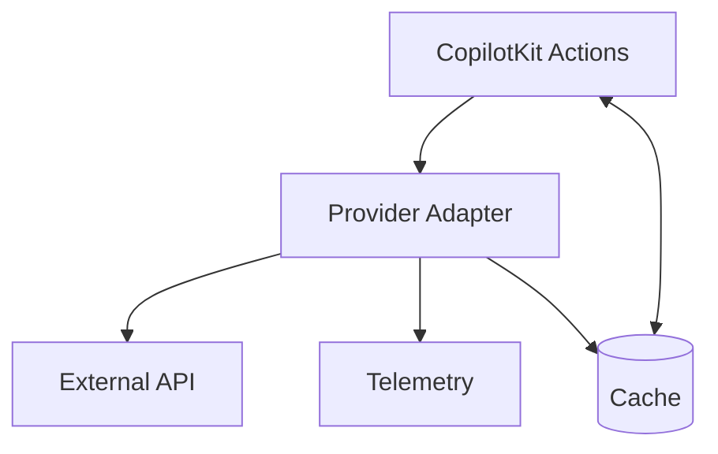

# API Integration Plan — External Regulatory/Knowledge Services

## Objectives

- Integrate external APIs for regulatory guidance or domain knowledge
- Maintain reliability via adapter pattern, retries, and fallbacks
- Ensure observability and contract safety via tests and telemetry

## Scope

- Read-only or advisory calls to compliance/knowledge APIs
- No PII transmission unless explicitly approved and masked

## Architecture

- Adapter pattern per provider (client + mapper)
- Circuit breaker with exponential backoff
- Central telemetry and attribution
- Typed contracts with validation



## Error Handling

- Timeouts with retry/backoff, capped attempts
- Fallbacks: cached results → static KB → disable integration
- Structured error objects with impact level

## Security

- API keys in secrets store, rotated regularly
- Input validation to avoid SSRF and injection
- Allow-listed domains/endpoints
- Optional anonymization of queries

## Implementation Steps

1) Research & Contracts

- Identify required endpoints and rate limits
- Define typed request/response DTOs
- Decide on masking strategy and PII treatment

1) Adapter & Client

- Implement provider client with timeouts
- Add adapter mapping to internal models
- Add circuit breaker and retries

1) Observability & Cache

- Add telemetry: latency, errors, hit rates
- Introduce cache with TTL
- Attribute knowledge sources in UI

1) Testing

- Contract tests with recorded fixtures/mocks
- Failure-mode tests (timeouts, 4xx/5xx, schema drift)
- Load test basic concurrency

1) Rollout

- Feature flag per provider
- Canary in staging, validate metrics
- Gradual enablement with alerts

## Commands

```bash
*workflow api-integration
*agent architect
*task design-integration-plan
```
