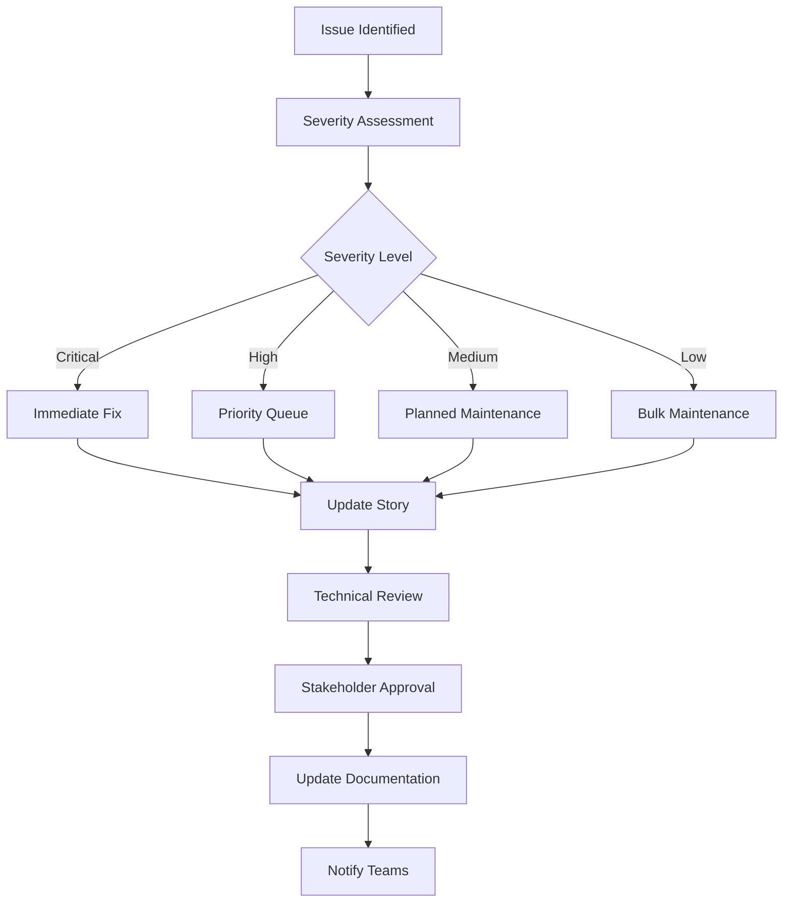

# Story Maintenance Procedures

## Overview

This document outlines the procedures for maintaining story quality and currency throughout the Langflow Architect project lifecycle, ensuring stories remain accurate, relevant, and actionable as the project evolves.

## Maintenance Framework

### Maintenance Types

#### 1. Reactive Maintenance
- **Trigger**: Issues discovered during implementation or post-deployment
- **Scope**: Address specific problems or inconsistencies
- **Timeline**: Within 48 hours of issue identification
- **Responsibility**: Story author or assigned maintainer

#### 2. Proactive Maintenance
- **Trigger**: Scheduled review cycles or architecture changes
- **Scope**: Systematic review and updates for currency
- **Timeline**: Monthly for active epics, quarterly for completed epics
- **Responsibility**: Product Manager with technical review

#### 3. Architecture-Driven Maintenance
- **Trigger**: Significant architecture or technology changes
- **Scope**: Cascade updates across related stories
- **Timeline**: Within 1 week of architecture change approval
- **Responsibility**: Technical Architect with story author support

#### 4. Process Improvement Maintenance
- **Trigger**: Quality standard updates or process improvements
- **Scope**: Align stories with new standards and patterns
- **Timeline**: Within 2 weeks of standard updates
- **Responsibility**: Quality team with epic owners

## Maintenance Triggers

### Automatic Triggers

#### Code Integration Events
```yaml
maintenance_triggers:
  code_merge:
    - story_status_update
    - acceptance_criteria_validation
    - documentation_sync_check
  
  architecture_change:
    - impact_analysis
    - story_dependency_update
    - integration_pattern_validation
  
  dependency_update:
    - compatibility_check
    - story_requirement_update
    - testing_guidance_refresh
```

#### Quality Metrics Thresholds
- **Implementation Success Rate < 80%**: Story clarity review required
- **Review Cycle Time > 5 days**: Story completeness assessment
- **Developer Questions > 3 per story**: Technical detail enhancement
- **Post-deployment Issues > 2**: Acceptance criteria review

### Manual Triggers

#### Developer Feedback
- Implementation difficulty reports
- Missing technical details
- Outdated references or patterns
- Integration challenges

#### User Feedback
- Feature usability issues
- Unmet user expectations
- Missing functionality
- Performance concerns

#### Stakeholder Requests
- Business requirement changes
- Compliance requirement updates
- Strategic priority shifts
- Technology constraint changes

## Maintenance Procedures

### Procedure 1: Issue-Based Maintenance

#### Step 1: Issue Identification and Triage
```markdown
## Issue Report Template

**Reporter**: [Name/Role]
**Date**: [Date]
**Story Affected**: [Epic.Story] - [Title]
**Issue Type**: [Technical/Business/Quality/Process]
**Severity**: [Critical/High/Medium/Low]

### Issue Description
[Detailed description of the problem]

### Impact Assessment
- **Implementation Impact**: [How this affects current/future implementation]
- **User Impact**: [How this affects end users]
- **Business Impact**: [Business consequences]

### Suggested Resolution
[Proposed fix or improvement]

### Supporting Evidence
- [Links to code, discussions, or documentation]
- [Screenshots or examples if applicable]
```

#### Step 2: Impact Analysis
**Critical Issues (Fix within 24 hours)**
- Story blocks current development
- Incorrect technical specifications
- Security or compliance violations
- Breaking changes to existing functionality

**High Priority Issues (Fix within 1 week)**
- Story causes significant implementation delays
- Missing critical technical details
- Outdated integration patterns
- User experience problems

**Medium Priority Issues (Fix within 2 weeks)**
- Minor technical inaccuracies
- Unclear documentation
- Sub-optimal implementation guidance
- Process improvement opportunities

**Low Priority Issues (Fix in next maintenance cycle)**
- Cosmetic documentation issues
- Minor optimization opportunities
- Enhancement suggestions
- Non-critical reference updates

#### Step 3: Maintenance Execution


### Procedure 2: Scheduled Maintenance

#### Monthly Active Epic Review

**Week 1: Story Currency Check**
- [ ] **Reference Validation**: Verify all external links are current and accessible
- [ ] **Dependency Check**: Confirm all dependencies are still valid
- [ ] **Integration Pattern Updates**: Ensure integration patterns match current standards
- [ ] **Performance Benchmark Updates**: Update performance criteria based on current system state

**Week 2: Technical Accuracy Review**
- [ ] **Code Pattern Validation**: Verify code examples and patterns are current
- [ ] **API Documentation Sync**: Ensure API references match current implementations
- [ ] **Configuration Updates**: Update environment and configuration details
- [ ] **Testing Framework Alignment**: Align testing guidance with current frameworks

**Week 3: Quality Standard Compliance**
- [ ] **Coding Standard Updates**: Ensure stories reflect current coding standards
- [ ] **Documentation Standard Alignment**: Align with current documentation standards
- [ ] **Process Compliance Check**: Verify stories follow current process requirements
- [ ] **Quality Metric Validation**: Confirm quality metrics are achievable and relevant

**Week 4: Stakeholder Feedback Integration**
- [ ] **Developer Feedback Review**: Address accumulated developer feedback
- [ ] **User Experience Updates**: Incorporate UX feedback and improvements
- [ ] **Business Value Validation**: Confirm stories still deliver intended business value
- [ ] **Strategic Alignment Check**: Ensure stories align with current strategic priorities

#### Quarterly Comprehensive Review

**Quarter Planning (Month 1)**
- Epic-level health assessment
- Story portfolio analysis
- Maintenance priority planning
- Resource allocation for maintenance

**Execution Phase (Month 2)**
- Systematic story updates
- Architecture alignment validation
- Cross-epic consistency check
- Documentation consolidation

**Validation Phase (Month 3)**
- Quality assurance validation
- Stakeholder acceptance testing
- Process effectiveness assessment
- Lessons learned documentation

### Procedure 3: Architecture Change Cascade

#### Change Impact Assessment
```typescript
// Example architecture change impact analysis
interface ArchitectureChange {
  change_id: string;
  description: string;
  affected_components: string[];
  breaking_changes: boolean;
  migration_required: boolean;
}

function assessStoryImpact(change: ArchitectureChange, stories: Story[]): StoryImpactReport {
  return {
    directly_affected: stories.filter(s => 
      s.components.some(c => change.affected_components.includes(c))
    ),
    indirectly_affected: stories.filter(s => 
      s.dependencies.some(d => change.affected_components.includes(d))
    ),
    migration_required: change.breaking_changes ? stories.filter(s => 
      s.integration_points.some(ip => change.affected_components.includes(ip))
    ) : [],
    update_priority: calculateUpdatePriority(change, stories)
  };
}
```

#### Cascade Update Process
1. **Identify Affected Stories**: Use automated analysis to identify stories requiring updates
2. **Prioritize Updates**: Critical stories first, then by epic dependency order
3. **Update Stories**: Apply necessary changes with technical review
4. **Validate Changes**: Ensure updates maintain story quality and completeness
5. **Coordinate Communication**: Notify development teams of changes

## Maintenance Quality Standards

### Update Quality Checklist

#### Content Quality
- [ ] **Accuracy**: All technical information is correct and current
- [ ] **Completeness**: No information gaps or missing details
- [ ] **Clarity**: Language is clear and unambiguous
- [ ] **Consistency**: Terminology and patterns are consistent across stories

#### Technical Quality
- [ ] **Architecture Compliance**: Updates follow current architecture patterns
- [ ] **Integration Accuracy**: Integration points are correctly specified
- [ ] **Code Example Currency**: Code examples use current syntax and patterns
- [ ] **Performance Relevance**: Performance criteria reflect current system capabilities

#### Process Quality
- [ ] **Standard Compliance**: Updates follow current documentation standards
- [ ] **Review Process**: Updates go through appropriate review process
- [ ] **Change Documentation**: Changes are properly documented and tracked
- [ ] **Stakeholder Communication**: Relevant stakeholders are notified of changes

### Maintenance Documentation

#### Change Log Format
```markdown
## Story Maintenance Log

### [Date] - [Change Type] - [Maintainer]
**Change Description**: [Brief description of what was changed]
**Reason**: [Why the change was necessary]
**Impact**: [What parts of the story were affected]
**Validation**: [How the change was validated]
**References**: [Links to supporting documentation or decisions]

#### Changed Sections:
- [Section 1]: [Specific changes made]
- [Section 2]: [Specific changes made]

#### Breaking Changes:
- [Any breaking changes that affect implementation]

#### Migration Notes:
- [Any notes for teams working on this story]
```

#### Maintenance Metrics Tracking
```yaml
maintenance_metrics:
  story_health:
    - last_updated: timestamp
    - update_frequency: number
    - issue_count: number
    - implementation_success_rate: percentage
  
  maintenance_efficiency:
    - average_resolution_time: duration
    - maintenance_overhead: percentage
    - automation_coverage: percentage
    - proactive_vs_reactive_ratio: ratio
  
  quality_trends:
    - issue_recurrence_rate: percentage
    - maintenance_caused_errors: number
    - stakeholder_satisfaction: score
    - process_compliance: percentage
```

## Maintenance Tools and Automation

### Automated Maintenance Tasks

#### Link Validation
```bash
#!/bin/bash
# Automated link checker for story maintenance
find docs/stories -name "*.md" -exec grep -l "http" {} \; | while read file; do
  echo "Checking links in $file"
  grep -oP 'https?://[^\s\)]+' "$file" | while read url; do
    if ! curl -s --head "$url" | head -n 1 | grep -q "200 OK"; then
      echo "BROKEN: $url in $file"
    fi
  done
done
```

#### Reference Currency Check
```typescript
// Automated reference validation
async function validateStoryReferences(story: Story): Promise<ReferenceValidationReport> {
  const reports = await Promise.all(
    story.references.map(async ref => ({
      reference: ref,
      accessible: await checkAccessibility(ref.url),
      current: await checkCurrency(ref.url, ref.last_validated),
      relevant: await assessRelevance(ref.content, story.content)
    }))
  );
  
  return {
    total_references: reports.length,
    broken_links: reports.filter(r => !r.accessible),
    outdated_content: reports.filter(r => !r.current),
    irrelevant_references: reports.filter(r => !r.relevant),
    health_score: calculateReferenceHealthScore(reports)
  };
}
```

#### Consistency Validation
```typescript
// Cross-story consistency checker
function validateCrossStoryConsistency(stories: Story[]): ConsistencyReport {
  return {
    naming_inconsistencies: checkNamingConsistency(stories),
    pattern_deviations: checkPatternConsistency(stories),
    dependency_conflicts: checkDependencyConsistency(stories),
    integration_mismatches: checkIntegrationConsistency(stories)
  };
}
```

### Manual Maintenance Tools

#### Story Health Dashboard
- Last update timestamps
- Issue count by story
- Implementation success rates
- Maintenance urgency indicators

#### Maintenance Planning Tools
- Maintenance backlog management
- Resource allocation tracking
- Priority assessment workflows
- Impact analysis calculators

#### Quality Tracking Tools
- Maintenance metrics dashboard
- Trend analysis reports
- Stakeholder feedback collection
- Process effectiveness metrics

## Maintenance Team Structure

### Roles and Responsibilities

#### Maintenance Coordinator
**Responsibilities**:
- Overall maintenance strategy and planning
- Resource allocation and prioritization
- Process improvement and optimization
- Stakeholder communication and reporting

**Required Skills**:
- Project management experience
- Understanding of software development lifecycle
- Communication and coordination skills
- Process improvement expertise

#### Technical Maintainers
**Responsibilities**:
- Technical accuracy validation
- Architecture alignment verification
- Code example and pattern updates
- Integration point validation

**Required Skills**:
- Software development expertise
- Architecture and design knowledge
- Current technology stack familiarity
- Code review and quality assessment skills

#### Quality Assurance Maintainers
**Responsibilities**:
- Quality standard compliance
- Documentation consistency
- Process adherence validation
- User experience impact assessment

**Required Skills**:
- Quality assurance experience
- Documentation and technical writing
- User experience understanding
- Process compliance expertise

### Maintenance Workflows

#### Daily Maintenance Tasks
- Monitor automated maintenance alerts
- Triage new maintenance requests
- Review and approve urgent maintenance updates
- Update maintenance metrics dashboard

#### Weekly Maintenance Tasks
- Review maintenance backlog and priorities
- Conduct scheduled story health checks
- Analyze maintenance metrics and trends
- Plan upcoming maintenance activities

#### Monthly Maintenance Tasks
- Comprehensive epic health assessment
- Stakeholder feedback review and integration
- Maintenance process effectiveness review
- Resource allocation and planning updates

## Success Metrics

### Story Health Metrics
- **Story Currency Score**: Percentage of stories with up-to-date information
- **Reference Health**: Percentage of working, relevant references
- **Implementation Success Rate**: Percentage of stories implemented without major issues
- **Maintenance Efficiency**: Average time to resolve maintenance issues

### Process Effectiveness Metrics
- **Proactive vs Reactive Ratio**: Percentage of proactive maintenance vs issue-driven maintenance
- **Automation Coverage**: Percentage of maintenance tasks automated
- **Stakeholder Satisfaction**: Satisfaction scores from developers and product teams
- **Process Compliance**: Percentage of maintenance activities following established procedures

### Quality Impact Metrics
- **Error Reduction**: Reduction in story-related implementation errors
- **Development Velocity**: Impact of maintenance on development speed
- **Documentation Quality**: Improvement in documentation quality scores
- **Technical Debt**: Reduction in story-related technical debt

## Training and Onboarding

### Maintainer Training Program

#### Basic Training (8 hours)
- Story structure and quality standards
- Maintenance tools and processes
- Documentation standards and patterns
- Quality assessment techniques

#### Advanced Training (16 hours)
- Architecture analysis and impact assessment
- Cross-epic dependency management
- Process improvement methodologies
- Stakeholder communication and management

#### Certification Requirements
- Pass maintenance simulation exercises
- Complete supervised maintenance tasks
- Demonstrate tool proficiency
- Achieve quality standard compliance

### Ongoing Education
- Monthly best practices sharing sessions
- Quarterly tool and process updates
- Annual maintenance methodology training
- Continuous feedback and improvement workshops

---

## Change Log

| Date | Version | Change | Author |
|------|---------|--------|--------|
| 2025-08-27 | 1.0 | Initial story maintenance procedures | Maintenance Team |