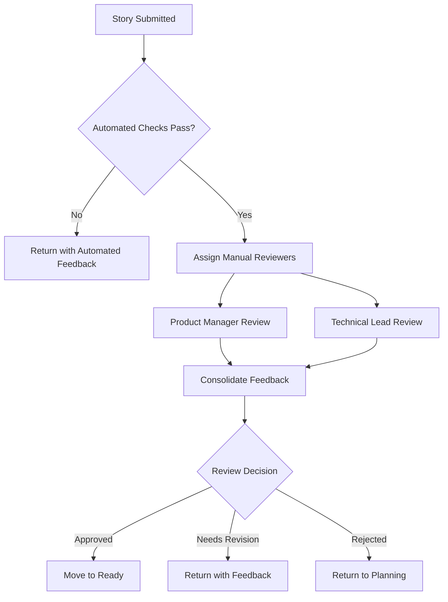

# Story Review Process

## Overview

This document defines the standardized process for reviewing stories throughout their lifecycle, ensuring consistent quality and alignment with project objectives in the Langflow Architect project.

## Review Framework

### Review Types

#### 1. Initial Story Review (Pre-Implementation)
- **Trigger**: Story submitted for development
- **Reviewer**: Product Manager + Technical Lead
- **Duration**: 1-2 business days
- **Purpose**: Validate readiness for development

#### 2. Mid-Development Review (Optional)
- **Trigger**: Developer request or significant scope questions
- **Reviewer**: Technical Lead + Domain Expert
- **Duration**: Same day response
- **Purpose**: Address implementation questions and scope clarification

#### 3. Completion Review (Pre-Merge)
- **Trigger**: Story implementation complete, ready for merge
- **Reviewer**: QA Lead + Product Manager
- **Duration**: 2-3 business days
- **Purpose**: Validate acceptance criteria and quality standards

#### 4. Post-Implementation Review (Retrospective)
- **Trigger**: 1 week after story deployment
- **Reviewer**: Full team retrospective
- **Duration**: 30-minute team meeting
- **Purpose**: Identify process improvements and lessons learned

## Review Process Workflow

### Phase 1: Initial Story Submission

#### Step 1: Automated Validation
```yaml
# Automated checks performed on story submission
automated_checks:
  - story_format_validation
  - acceptance_criteria_completeness
  - required_sections_present
  - link_accessibility_check
  - spelling_and_grammar_check
```

**Automated Validation Criteria:**
- [ ] Story follows standard template format
- [ ] All required sections are present and non-empty
- [ ] Acceptance criteria are numbered and specific
- [ ] All external links are accessible
- [ ] No obvious spelling or grammatical errors

#### Step 2: Manual Review Assignment


### Phase 2: Manual Review Process

#### Product Manager Review Checklist

**Business Value Assessment**
- [ ] **Value Proposition**: Story delivers clear business value
- [ ] **User Benefit**: Benefit to end users is clearly articulated
- [ ] **Strategic Alignment**: Story aligns with product strategy and roadmap
- [ ] **Priority Justification**: Story priority is appropriate for current sprint

**Requirements Quality**
- [ ] **Scope Clarity**: Story scope is well-defined and bounded
- [ ] **Acceptance Criteria**: Criteria are specific, measurable, and testable
- [ ] **Edge Cases**: Important edge cases are considered
- [ ] **User Experience**: UX implications are addressed appropriately

**Resource and Timeline**
- [ ] **Effort Estimation**: Story size is appropriate for development capacity
- [ ] **Dependency Management**: Dependencies are identified and managed
- [ ] **Risk Assessment**: Business risks are identified with mitigation plans
- [ ] **Success Metrics**: Clear metrics for measuring story success

#### Technical Lead Review Checklist

**Technical Feasibility**
- [ ] **Implementation Path**: Technical approach is sound and feasible
- [ ] **Architecture Compliance**: Story follows established architecture patterns
- [ ] **Component Integration**: Integration points are clearly defined
- [ ] **Performance Impact**: Performance implications are considered

**Development Readiness**
- [ ] **Technical Specification**: Sufficient technical detail for implementation
- [ ] **File Locations**: Specific file paths and component names provided
- [ ] **API Definitions**: Required APIs and interfaces are specified
- [ ] **Configuration Details**: Environment and configuration requirements defined

**Quality and Maintenance**
- [ ] **Testing Strategy**: Comprehensive testing approach is outlined
- [ ] **Code Quality**: Quality standards and patterns are specified
- [ ] **Documentation**: Required documentation is identified
- [ ] **Monitoring**: Post-deployment monitoring approach is defined

### Phase 3: Review Decision Matrix

| Criteria Met | PM Review | Tech Review | Decision | Next Action |
|-------------|-----------|-------------|----------|-------------|
| All Critical | ✅ Pass | ✅ Pass | **APPROVED** | Move to Ready |
| Most Critical | ✅ Pass | ⚠️ Minor Issues | **CONDITIONAL** | Address tech issues |
| Most Critical | ⚠️ Minor Issues | ✅ Pass | **CONDITIONAL** | Address PM issues |
| Some Critical | ✅ Pass | ❌ Major Issues | **NEEDS REVISION** | Tech rework required |
| Some Critical | ❌ Major Issues | ✅ Pass | **NEEDS REVISION** | PM rework required |
| Critical Missing | ❌ Major Issues | ❌ Major Issues | **REJECTED** | Return to planning |

### Phase 4: Feedback and Revision Process

#### Feedback Categories

**Critical Issues (Must Fix)**
- Block story implementation
- Violate project standards
- Missing essential information
- Create unacceptable risks

**Significant Issues (Should Fix)**
- May cause implementation delays
- Reduce story quality
- Create maintenance burden
- Impact user experience

**Minor Issues (Nice to Fix)**
- Improve clarity or efficiency
- Enhance documentation
- Optimize implementation approach
- Reduce future technical debt

#### Feedback Format

```markdown
## Story Review Feedback

**Story**: [Epic.Story] - [Title]
**Review Date**: [Date]
**Reviewers**: [Names]
**Decision**: [APPROVED/CONDITIONAL/NEEDS REVISION/REJECTED]

### Critical Issues (Must Fix Before Approval)
1. **[Issue Category]**: [Specific issue description]
   - **Impact**: [How this blocks implementation]
   - **Recommendation**: [Specific action to resolve]
   - **Reference**: [Link to relevant guideline/pattern]

### Significant Issues (Should Address)
1. **[Issue Category]**: [Specific issue description]
   - **Impact**: [Potential problems this could cause]
   - **Recommendation**: [Suggested improvement]

### Minor Issues (Consider Addressing)
1. **[Issue Category]**: [Specific issue description]
   - **Benefit**: [How fixing this would help]
   - **Suggestion**: [Optional improvement]

### Positive Highlights
- [Things done particularly well]
- [Good practices followed]
- [Clear documentation or examples]

### Next Steps
- [ ] [Specific action required from story author]
- [ ] [Timeline for addressing feedback]
- [ ] [Re-review requirements]
```

## Review Standards by Epic

### Epic 1 (Standalone Foundation) Standards
- **Architecture**: Must follow Next.js and React best practices
- **Testing**: Comprehensive Jest and React Testing Library coverage
- **Documentation**: Clear setup and deployment instructions
- **Performance**: Initial load time under 3 seconds

### Epic 5 (Enhanced Agent Intelligence) Standards
- **Integration**: Must integrate with existing context engine
- **MCP Compliance**: Follow established MCP server patterns
- **Search Integration**: Proper integration with Tavily and web search
- **Context Management**: Maintain conversation context across sessions

### Epic 6.4 (Domain Expertise) Standards
- **Domain Detection**: >90% accuracy in domain identification
- **Compliance**: Support for HIPAA, GDPR, SOX, PCI-DSS
- **Expertise Adaptation**: Appropriate complexity for user expertise level
- **Code Quality**: Zero ESLint warnings, optimal cognitive complexity

## Quality Gates

### Gate 1: Story Readiness
**Criteria for Passing**:
- All automated checks pass
- Manual review score ≥80%
- No critical issues identified
- All dependencies resolved

**Gate Actions**:
- Move story to "Ready" status
- Assign to development sprint
- Notify development team
- Update epic progress tracking

### Gate 2: Implementation Quality
**Criteria for Passing**:
- All acceptance criteria met
- Code review approved
- Test coverage ≥85%
- Performance benchmarks met

**Gate Actions**:
- Approve merge to main branch
- Update story status to "Complete"
- Trigger deployment pipeline
- Schedule post-implementation review

### Gate 3: Post-Deployment Validation
**Criteria for Passing**:
- No critical bugs reported within 48 hours
- Performance metrics within acceptable range
- User feedback positive (if applicable)
- Monitoring alerts at normal levels

**Gate Actions**:
- Story marked as "Deployed"
- Success metrics begin tracking
- Knowledge transfer to support team
- Archive development artifacts

## Review Tools and Automation

### Automated Review Tools

**Story Format Validator**
```typescript
// Example automated validation
export function validateStoryFormat(story: Story): ValidationResult {
  const checks = [
    validateUserStoryFormat(story.description),
    validateAcceptanceCriteria(story.acceptanceCriteria),
    validateTechnicalRequirements(story.technicalRequirements),
    validateTestingGuidance(story.testing)
  ];
  
  return {
    passed: checks.every(check => check.passed),
    issues: checks.flatMap(check => check.issues),
    score: calculateValidationScore(checks)
  };
}
```

**Link Checker**
```bash
# Automated link validation
#!/bin/bash
story_file=$1
grep -oP 'https?://[^\s\)]+' "$story_file" | while read url; do
  if ! curl -s --head "$url" | head -n 1 | grep -q "200 OK"; then
    echo "Broken link: $url"
  fi
done
```

### Review Dashboard

**Story Review Status Board**
- Stories awaiting review
- Review assignments and due dates
- Review bottlenecks and delays
- Quality metrics by reviewer

**Quality Metrics Tracking**
- Average review cycle time
- Review approval rates by epic
- Most common feedback categories
- Reviewer workload distribution

## Reviewer Guidelines

### Best Practices for Reviewers

#### Preparation
- [ ] **Understand Context**: Review related epics and previous stories
- [ ] **Check Standards**: Ensure familiarity with current project standards
- [ ] **Time Allocation**: Allow adequate time for thorough review
- [ ] **Bias Check**: Consider personal biases and domain expertise limitations

#### During Review
- [ ] **Focus on Standards**: Apply validation checklist consistently
- [ ] **Provide Context**: Explain reasoning behind feedback
- [ ] **Be Specific**: Offer concrete, actionable recommendations
- [ ] **Balance Criticism**: Acknowledge positive aspects along with issues

#### Feedback Delivery
- [ ] **Clear Communication**: Use clear, professional language
- [ ] **Prioritize Issues**: Distinguish between critical, significant, and minor issues
- [ ] **Offer Solutions**: Suggest specific improvements where possible
- [ ] **Reference Standards**: Link to relevant guidelines and examples

### Reviewer Training

**New Reviewer Onboarding**
1. **Standards Training**: 2-hour session on project standards and guidelines
2. **Shadow Reviews**: Participate in 3 reviews with experienced reviewer
3. **Practice Reviews**: Conduct 2 practice reviews with feedback
4. **Certification**: Pass review simulation with 85% accuracy

**Ongoing Education**
- Monthly review calibration sessions
- Quarterly standards updates training
- Annual review process retrospectives
- Continuous feedback on review quality

## Process Improvement

### Metrics and KPIs

**Efficiency Metrics**
- Average review cycle time by epic
- Review rework rates (stories requiring multiple review cycles)
- Time from story submission to development start
- Developer wait time for story reviews

**Quality Metrics**
- Post-implementation defect rates by reviewer
- Story acceptance rate on first development attempt
- Developer satisfaction with story quality
- Business value delivery rates

**Process Metrics**
- Reviewer utilization and workload balance
- Review bottleneck identification
- Feedback category trends
- Process compliance rates

### Continuous Improvement Process

**Monthly Review Process Assessment**
- Review cycle time analysis
- Quality trends identification
- Reviewer feedback collection
- Process bottleneck analysis

**Quarterly Process Updates**
- Standards and guidelines updates
- Tool and automation improvements
- Reviewer training enhancements
- Workflow optimization

**Annual Process Retrospective**
- Comprehensive process evaluation
- ROI analysis of review process
- Strategic process improvements
- Long-term quality trend analysis

## Integration with Development Workflow

### Development Tool Integration

**Jira/Project Management Integration**
- Automated status updates based on review decisions
- Review assignment and tracking
- Quality metrics dashboard integration
- Sprint planning integration

**Git/Code Review Integration**
- Link story reviews to code reviews
- Automated quality gate enforcement
- Review decision tracking in commit messages
- Branch protection based on story review status

**Communication Integration**
- Slack notifications for review status changes
- Email summaries of pending reviews
- Team dashboard with review metrics
- Escalation workflows for delayed reviews

---

## Change Log

| Date | Version | Change | Author |
|------|---------|--------|--------|
| 2025-08-27 | 1.0 | Initial story review process documentation | Process Team |